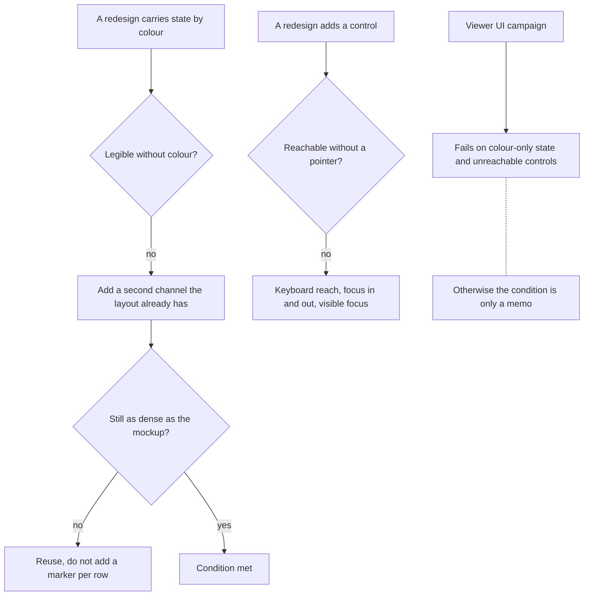

## prod_088_a_viewer_that_does_not_require_perfect_eyes_or_a_mouse - A viewer that does not require perfect eyes or a mouse
> Date: 2026-08-13
> Status: Settled
> Related request: `req_352_keep_the_viewer_redesigns_legible_without_colour_and_reachable_without_a_mouse`
> Related backlog: `item_767_give_every_colour_carried_state_a_second_channel`, `item_768_make_the_new_controls_reachable_without_a_mouse`, `item_769_let_the_campaign_fail_on_colour_only_state_and_unreachable_controls`
> Related task: `task_349_deliver_the_colour_and_keyboard_conditions_for_the_redesigns`
> Related architecture: (none yet)
> Reminder: Update status, linked refs, scope, decisions, success signals, and open questions when you edit this doc.
> Indicators reviewed: 2026-08-14 19:07:50

# Overview
The viewer redesigns bought their density by moving meaning onto colour and onto controls that appear under a pointer. Both are good decisions and both have a cost that has to be paid once, deliberately, rather than discovered by whoever cannot use the result. The product already carries sixty-seven accessibility attributes and checks its heading structure on every campaign run; the new work should not be the part that stops doing that.

# Goals
- State carried by colour is also carried by something else.
- Every new control is reachable without a pointer.
- The conditions are enforced by a check, not by memory.

# Non-goals
- A full accessibility audit of the existing viewer.
- Screens the nine active chains do not touch, and the Workshop Terminals tab.
- Undoing the density the redesigns were for.

# Scope and guardrails
- In: scaffolded request, product, backlog, orchestration task, validation, and handoff context.
- Out: unrelated workflow docs and implementation of generated tasks.

# Key product decisions
- Use structured input as the source of truth for generated docs.
- Keep generated write paths local and repo-bounded.

# Success signals
- Every state the viewer draws in colour is legible without it. The channel is the accent bar the rows already carry -- style and width -- so nothing per-row was added and the density the redesigns won is kept.
- The condition is enforced rather than remembered: a campaign check compares every pair of states a component shows with hue removed, and names the two that look alike.
- The check lists no state names. It reads the BEM structure, so a state added tomorrow is covered without editing it.
- Every control the redesigns introduced can be reached and operated from a keyboard. Audited: 34 controls in `index.html`, 0 unreachable, and every campaign surface reports its own count.
- A focused control is visibly focused everywhere, held by one `:focus-visible` rule rather than the twenty somebody remembered -- so the twenty-first control has a ring.
- Focus goes into a modal and comes back out to whatever opened it, and Tab does not escape to the board behind the backdrop.

# References
- Product back-reference: `req_352_keep_the_viewer_redesigns_legible_without_colour_and_reachable_without_a_mouse`
- Task back-reference: `task_349_deliver_the_colour_and_keyboard_conditions_for_the_redesigns`
