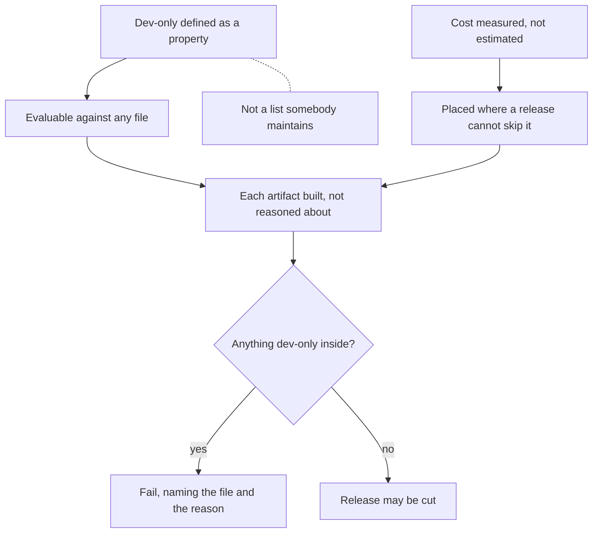

## prod_089_a_release_that_contains_only_the_product - A release that contains only the product
> Date: 2026-08-13
> Status: Proposed
> Related request: `req_353_prove_a_published_artifact_contains_only_the_product`
> Related backlog: `item_771_define_dev_only_as_a_property_rather_than_a_list`, `item_772_build_each_published_artifact_and_inspect_what_is_inside_it`, `item_773_put_the_check_where_a_release_cannot_skip_it`
> Related task: `task_350_deliver_the_released_artifact_content_check`
> Related architecture: (none yet)
> Reminder: Update status, linked refs, scope, decisions, success signals, and open questions when you edit this doc.

# Overview
Development affordances earn their place in a checkout and lose it in a release. One of them reached users because its gate was inferred from something a release happened to carry; that instance is fixed. What remains is the class: nothing checks that a published artifact contains only the product, and nothing defines what that means.

# Goals
- Dev-only is a property a file has, not a list someone maintains.
- Every published artifact is checked against it, built rather than reasoned about.
- A failure names the file and the reason.

# Non-goals
- The demo board, delivered and closed under req_343.
- Changing what the three channels ship.
- Auditing the current artifacts before the definition exists.

# Scope and guardrails
- In: scaffolded request, product, backlog, orchestration task, validation, and handoff context.
- Out: unrelated workflow docs and implementation of generated tasks.

# Key product decisions
- Use structured input as the source of truth for generated docs.
- Keep generated write paths local and repo-bounded.

# Success signals
- Generated docs pass lint and audit without broad manual rewrites.
- Context-pack output can be handed to an implementation agent directly.

# References
- Product back-reference: `req_353_prove_a_published_artifact_contains_only_the_product`
- Task back-reference: `task_350_deliver_the_released_artifact_content_check`
