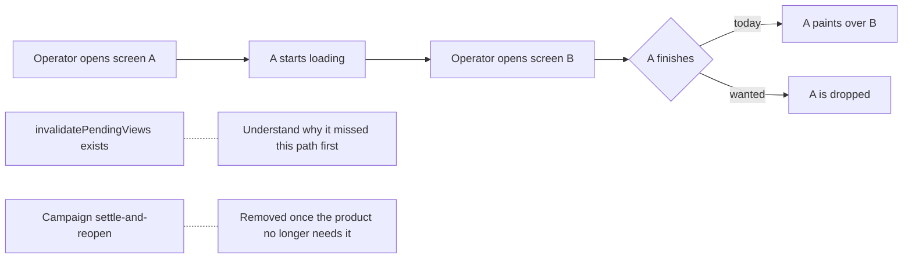

## prod_090_a_viewer_that_knows_which_screen_you_are_on - A viewer that knows which screen you are on
> Date: 2026-08-13
> Status: Proposed
> Related request: `req_354_stop_a_slow_screen_from_rendering_over_the_one_the_operator_moved_to`
> Related backlog: `item_774_establish_why_the_pending_view_guard_does_not_cover_a_late_screen_render`, `item_775_drop_a_screen_s_late_render_when_the_operator_has_moved_on`, `item_776_take_the_workaround_back_out_of_the_campaign`, `item_777_find_out_whether_a_relaunch_can_reuse_a_server_that_is_gone`
> Related task: `task_351_deliver_the_superseded_render_guard`
> Related architecture: (none yet)
> Reminder: Update status, linked refs, scope, decisions, success signals, and open questions when you edit this doc.

# Overview
Screens load at different speeds, and some take twenty seconds against a large corpus. An operator who does not wait should not be punished for it: what they asked for last is what they should be looking at. A late answer to a question nobody is asking any more should be dropped, not painted over the current one.

# Goals
- The screen an operator asked for last is the screen they get.
- A guard that exists is understood before a second one is added beside it.
- A workaround in a test is removed when the product stops needing it.

# Non-goals
- Making slow screens fast, which is tracked separately.
- Designing for the reuse observation before it is confirmed.

# Scope and guardrails
- In: scaffolded request, product, backlog, orchestration task, validation, and handoff context.
- Out: unrelated workflow docs and implementation of generated tasks.

# Key product decisions
- Use structured input as the source of truth for generated docs.
- Keep generated write paths local and repo-bounded.

# Success signals
- Generated docs pass lint and audit without broad manual rewrites.
- Context-pack output can be handed to an implementation agent directly.

# References
- Product back-reference: `req_354_stop_a_slow_screen_from_rendering_over_the_one_the_operator_moved_to`
- Task back-reference: `task_351_deliver_the_superseded_render_guard`
