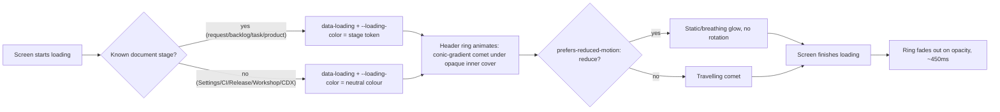

## prod_094_loading_border_trace - Loading border trace
> Date: 2026-08-15
> Status: Proposed
> Related request: `req_360_loading_border_trace_an_animated_ring_on_the_header_while_a_screen_loads`
> Related backlog: `item_788_build_the_reusable_loading_ring_css_mechanism_and_decide_the_neutral_colour`, `item_789_wire_the_loading_ring_into_the_real_viewer_screens`
> Related task: `task_360_orchestrate_the_loading_border_trace_feature`
> Related architecture: (none yet)
> Reminder: Update status, linked refs, scope, decisions, success signals, and open questions when you edit this doc.
> Indicators reviewed: 2026-08-15 00:46:39

# Overview
An ambient, stage-coloured animated ring on the viewer header that signals a screen is loading, reusing the app's existing colour tokens and respecting reduced-motion.

# Goals
- A slow screen load (10-20s against a large corpus) reads as active, not stuck.
- Zero new colour palette -- the ring's colours come from tokens the board already uses.

# Non-goals
- Redesigning the existing textual loading indicators.
- Any change to how long a screen actually takes to load -- this is feedback, not a performance fix.

# Scope and guardrails
- In: a reusable CSS ring mechanism (opaque inner cover + glow/sweep layer, `data-loading`/`--loading-color`-driven), a decided neutral colour for untyped screens, and wiring into the real viewer screens' existing loading signals.
- Out: redesigning the existing textual loading indicators, and any change to how long a screen actually takes to load.

# Key product decisions
- Colour comes entirely from the existing `--stage-color-*` tokens (`clients/shared-web/media/css/board.css`) for typed document screens, plus one newly-decided neutral colour for untyped screens (Settings, CI, Release, Workshop, CDX) — no new palette.
- The ring is driven by the loading state the viewer already tracks (`setMeta`/`showScreenLoading`), not a new parallel loading-tracking mechanism.
- Respect `prefers-reduced-motion: reduce` via a real media query (static/breathing glow, no rotation) rather than a manual opt-out.

# Success signals
- A slow screen load (10-20s against a large corpus) visibly reads as active rather than stuck.
- The existing loading text on every wired screen is unchanged before/after.
- No new CSS mask-based ring implementation is attempted — the opaque-inner-cover technique is already the proven approach (see request Context).

# Overview diagram

# References
- Product back-reference: `req_360_loading_border_trace_an_animated_ring_on_the_header_while_a_screen_loads`
- Task back-reference: `task_360_orchestrate_the_loading_border_trace_feature`
