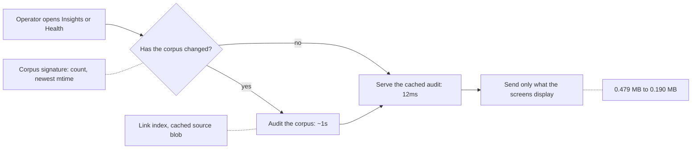

## prod_095_corpus_screens_that_stay_usable_as_the_corpus_grows - Corpus screens that stay usable as the corpus grows
> Date: 2026-08-15
> Status: Settled
> Related request: `req_364_make_insights_and_health_answer_quickly_on_a_large_corpus`
> Related backlog: `item_804_index_the_backlog_to_task_links_instead_of_re_scanning_for_each_item`, `item_805_serve_the_audit_answer_from_a_cache_keyed_on_the_corpus_not_on_a_timer`, `item_806_send_the_screens_the_findings_they_display_not_all_of_them`, `item_807_stop_rebuilding_the_repository_wide_source_blob_on_every_audit`, `item_808_memoise_the_remaining_reference_extraction`
> Related task: `task_375_orchestrate_the_audit_cost_work_behind_insights_and_health`
> Related architecture: (none yet)
> Reminder: Update status, linked refs, scope, decisions, success signals, and open questions when you edit this doc.
> Indicators reviewed: 2026-08-15 15:05:12

# Overview
Keep the viewer's reading screens -- Corpus insights and Validation health -- answering in about a second whatever the corpus size, by removing the work that grows faster than the corpus, reusing answers that have not changed, and sending only what the screens display.

# Goals
- Cost that grows in step with the corpus, not faster.
- An answer computed once and reused until the corpus actually changes.
- A payload sized by what the screen shows, not by what the scan found.
- The same findings as today: faster, not fewer.

# Non-goals
- Incremental auditing that persists per-document findings and re-checks only what changed: the checks are cross-document, so invalidating one document's result correctly means invalidating its link neighbourhood too. Worth reaching for above roughly twenty thousand documents, not at two.
- Changing what the audit checks, or which findings it reports.
- Redesigning either screen: this is about how long they take to answer, not what they say.
- Speeding up lint (0.16s) or the workflow health report (0.15s), neither of which is a cost worth attacking.

# Scope and guardrails
- In: scaffolded request, product, backlog, orchestration task, validation, and handoff context.
- Out: unrelated workflow docs and implementation of generated tasks.

# Key product decisions
- Use structured input as the source of truth for generated docs.
- Keep generated write paths local and repo-bounded.

# Success signals
- Generated docs pass lint and audit without broad manual rewrites.
- Context-pack output can be handed to an implementation agent directly.

# References
- Product back-reference: `req_364_make_insights_and_health_answer_quickly_on_a_large_corpus`
- Task back-reference: `task_375_orchestrate_the_audit_cost_work_behind_insights_and_health`
