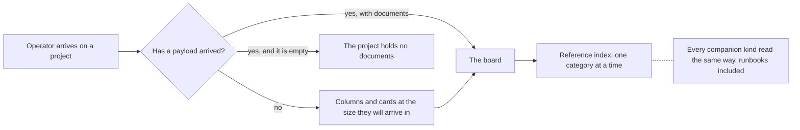

## prod_098_a_board_that_tells_the_truth_while_it_is_still_loading - A board that tells the truth while it is still loading
> Date: 2026-08-15
> Status: Settled
> Related request: `req_367_make_the_project_view_honest_on_arrival_and_let_runbooks_be_documents`
> Related backlog: `item_816_say_the_board_is_loading_instead_of_saying_the_project_is_empty`, `item_817_let_a_runbook_be_a_document_and_retire_its_screen`, `item_818_collapse_a_reference_category_on_its_own`, `item_819_make_getting_started_s_stage_list_say_something`
> Related task: `task_378_orchestrate_the_board_arrival_and_runbook_document_work`
> Related architecture: (none yet)
> Reminder: Update status, linked refs, scope, decisions, success signals, and open questions when you edit this doc.
> Indicators reviewed: 2026-08-15 15:05:12

# Overview
Make the first screen an operator sees state what it knows, treat every companion document the same way, and let the reference index be read a category at a time.

# Goals
- Never assert 'empty' when the answer is 'not yet known'.
- One way to read a document, whatever kind it is.
- A reference index that can be narrowed to what is being looked for.
- Counts that say something, or no counts.

# Non-goals
- Removing the bounded runbook lookup agents use -- the screen goes, the route stays.
- Changing what a runbook document contains or how it is validated.
- A skeleton for every screen: this is about the one an operator arrives on.
- Re-opening the stage colours.

# Scope and guardrails
- In: scaffolded request, product, backlog, orchestration task, validation, and handoff context.
- Out: unrelated workflow docs and implementation of generated tasks.

# Key product decisions
- Use structured input as the source of truth for generated docs.
- Keep generated write paths local and repo-bounded.

# Success signals
- Generated docs pass lint and audit without broad manual rewrites.
- Context-pack output can be handed to an implementation agent directly.

# References
- Product back-reference: `req_367_make_the_project_view_honest_on_arrival_and_let_runbooks_be_documents`
- Task back-reference: `task_378_orchestrate_the_board_arrival_and_runbook_document_work`
