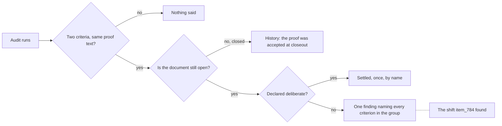

## prod_099_an_audit_worth_reading - An audit worth reading
> Date: 2026-08-15
> Status: Settled
> Related request: `req_368_make_the_duplicate_proof_check_say_something_a_reader_can_act_on`
> Related backlog: `item_821_report_a_shared_proof_once_not_once_per_pair`, `item_822_let_a_document_settle_a_deliberate_shared_proof`, `item_823_prove_the_check_still_finds_what_it_was_built_for`, `item_824_say_what_the_audit_s_remaining_warnings_are`
> Related task: `task_379_orchestrate_the_audit_signal_work`
> Related architecture: (none yet)
> Reminder: Update status, linked refs, scope, decisions, success signals, and open questions when you edit this doc.
> Indicators reviewed: 2026-08-15 15:27:19

# Overview
Keep every check that finds real defects, and stop the ones that report the normal case, so that a report with warnings in it is a reason to look.

# Goals
- One finding per thing to look at, not per pair of things.
- An operator can settle a legitimate pattern once instead of confirming it forever.
- Every check earns its noise: what it reports is dominated by defects, not by the shape it cannot tell from one.
- The count in the summary line means something.

# Non-goals
- Deleting the duplicate-proof check: the defect it found was real.
- Turning warnings into blocking findings, or the reverse, as a way of hiding them.
- Rewriting the 122 documents to satisfy a check that should not have asked.
- Changing what counts as a valid proof.

# Scope and guardrails
- In: scaffolded request, product, backlog, orchestration task, validation, and handoff context.
- Out: unrelated workflow docs and implementation of generated tasks.

# Key product decisions
- Use structured input as the source of truth for generated docs.
- Keep generated write paths local and repo-bounded.

# Success signals
- Generated docs pass lint and audit without broad manual rewrites.
- Context-pack output can be handed to an implementation agent directly.

# References
- Product back-reference: `req_368_make_the_duplicate_proof_check_say_something_a_reader_can_act_on`
- Task back-reference: `task_379_orchestrate_the_audit_signal_work`
