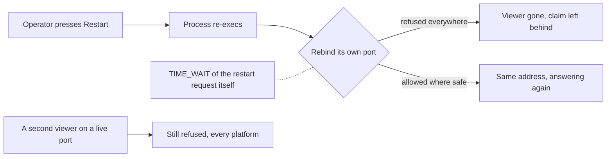

## prod_101_a_restart_that_comes_back - A restart that comes back
> Date: 2026-08-15
> Status: Settled
> Related request: `req_370_make_settings_restart_bring_the_viewer_back`
> Related backlog: `item_828_let_the_restart_rebind_its_own_port`, `item_829_stop_the_registry_advertising_a_viewer_that_is_gone`
> Related task: `task_381_orchestrate_the_restart_fix`
> Related architecture: (none yet)
> Reminder: Update status, linked refs, scope, decisions, success signals, and open questions when you edit this doc.

# Overview
Make the restart control in Settings do what its label says, without giving up the guarantee that one port carries one viewer.

# Goals
- A control in the product does what it says or is not there.
- The one-viewer-per-port guarantee holds on every platform, for the reason it was made.
- The registry describes what is running, not what was.

# Non-goals
- Making a `--port 0` viewer keep its port across restarts: it asked for any free port, and that is what it gets.
- Reopening the Windows finding that motivated the original refusal.
- Changing what restart does beyond coming back.

# Scope and guardrails
- In: scaffolded request, product, backlog, orchestration task, validation, and handoff context.
- Out: unrelated workflow docs and implementation of generated tasks.

# Key product decisions
- Use structured input as the source of truth for generated docs.
- Keep generated write paths local and repo-bounded.

# Success signals
- Generated docs pass lint and audit without broad manual rewrites.
- Context-pack output can be handed to an implementation agent directly.

# References
- Product back-reference: `req_370_make_settings_restart_bring_the_viewer_back`
- Task back-reference: `task_381_orchestrate_the_restart_fix`
