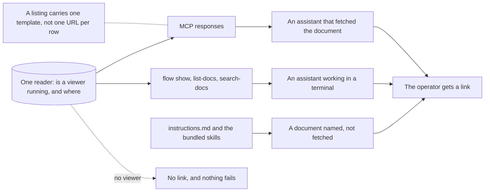

## prod_102_the_link_travels_with_the_document - The link travels with the document
> Date: 2026-08-15
> Status: Proposed
> Related request: `req_371_put_the_viewer_link_where_every_assistant_already_looks`
> Related backlog: `item_830_one_reader_for_where_the_viewer_is`, `item_831_carry_the_link_in_the_mcp_responses`, `item_832_print_the_link_from_the_cli`, `item_833_state_the_convention_where_an_assistant_reads_its_instructions`
> Related task: `task_382_orchestrate_the_link_travels_with_the_document_work`
> Related architecture: (none yet)
> Reminder: Update status, linked refs, scope, decisions, success signals, and open questions when you edit this doc.
> Indicators reviewed: 2026-08-15 16:28:38

# Overview
Make the viewer address arrive with every document any assistant reads, so that naming a document and linking to it are the same act for all of them, not a habit one of them holds.

# Goals
- One answer to where the viewer is, read by every surface.
- The link arrives as data, not as a convention to remember.
- Absent rather than wrong when there is no viewer.
- Read at response time, never stored: an address that outlives its viewer is worse than none.
- No surface pays for the link by the row.

# Non-goals
- Making an assistant use the link: this puts it under their hand, it does not compel them.
- A link to anything but a document.
- Changing the URL forms req_369 settled.
- Starting a viewer because something wanted to link to it.

# Scope and guardrails
- In: scaffolded request, product, backlog, orchestration task, validation, and handoff context.
- Out: unrelated workflow docs and implementation of generated tasks.

# Key product decisions
- Use structured input as the source of truth for generated docs.
- Keep generated write paths local and repo-bounded.

# Success signals
- Generated docs pass lint and audit without broad manual rewrites.
- Context-pack output can be handed to an implementation agent directly.

# References
- Product back-reference: `req_371_put_the_viewer_link_where_every_assistant_already_looks`
- Task back-reference: `task_382_orchestrate_the_link_travels_with_the_document_work`
