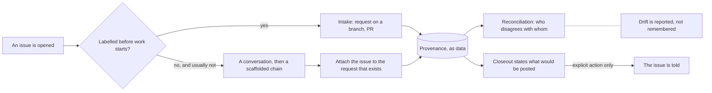

## prod_103_an_issue_bridge_on_the_path_people_walk - An issue bridge on the path people walk
> Date: 2026-08-15
> Status: Settled
> Related request: `req_372_put_the_github_issue_bridge_on_the_path_the_work_actually_takes`
> Related backlog: `item_834_report_where_the_corpus_and_the_tracker_disagree`
> Related task: `task_383_orchestrate_the_issue_bridge_work`
> Related architecture: (none yet)
> Reminder: Update status, linked refs, scope, decisions, success signals, and open questions when you edit this doc.
> Indicators reviewed: 2026-08-15 20:04:46

# Overview
Make the tracker and the corpus disagree visibly, and make closing the gap a step in the work rather than an errand after it.

# Goals
- Drift is reported, not remembered.
- The link can be made whenever it is noticed, not only at intake.
- Telling the tracker is part of finishing, and always deliberate.
- Provenance is data.

# Non-goals
- Mirroring GitHub discussions into the corpus, which `docs/github-issues.md` already rules out.
- Executing or trusting anything an issue body says.
- Posting to GitHub without an explicit action: an outward write is never a side effect.
- Replacing the intake workflow, which works for issues that are triaged before the work starts.
- Putting any of this on the auto-refresh tick. req_373 measured that tick at about 3.1s every 15s and exists to bring it down; reconciliation answers a question about a delivery, and is asked rather than polled.

# Scope and guardrails
- In: scaffolded request, product, backlog, orchestration task, validation, and handoff context.
- Out: unrelated workflow docs and implementation of generated tasks.

# Key product decisions
- Use structured input as the source of truth for generated docs.
- Keep generated write paths local and repo-bounded.

# Success signals
- Generated docs pass lint and audit without broad manual rewrites.
- Context-pack output can be handed to an implementation agent directly.

# References
- Product back-reference: `item_834_report_where_the_corpus_and_the_tracker_disagree`
- Task back-reference: `task_383_orchestrate_the_issue_bridge_work`
