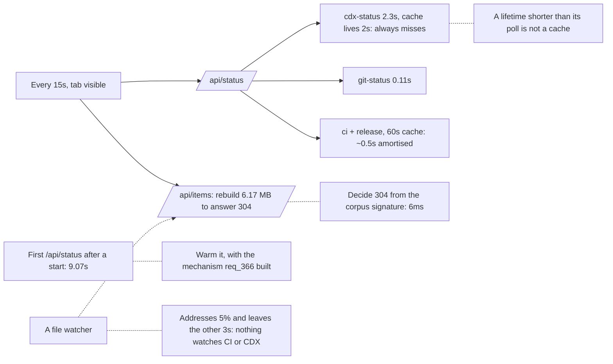

## prod_104_a_poll_that_costs_what_it_is_worth - A poll that costs what it is worth
> Date: 2026-08-15
> Status: Proposed
> Related request: `req_373_make_the_auto_refresh_cost_what_it_is_worth`
> Related backlog: `item_839_stop_paying_for_a_cache_that_can_never_hit`, `item_840_warm_the_badge_components_off_the_request_path`, `item_841_answer_nothing_changed_without_rebuilding_the_corpus`, `item_842_re_measure_the_tick_and_record_what_it_is_made_of`
> Related task: `task_384_orchestrate_the_auto_refresh_cost_work`
> Related architecture: (none yet)
> Reminder: Update status, linked refs, scope, decisions, success signals, and open questions when you edit this doc.
> Indicators reviewed: 2026-08-15 16:21:53

# Overview
Make an idle viewer idle: pay for what changed, not for asking whether anything did.

# Goals
- A cache whose lifetime is shorter than the poll consuming it is not a cache.
- Confirming that nothing changed is cheap enough to do often.
- Nothing expensive is discovered on the request path that a background pass could have paid for.
- Every number here is measured over HTTP, against a viewer started for the measurement.

# Non-goals
- A file watcher for the browser viewer: it would address the 0.156s line and leave the other 3s, since nothing can watch CI, release or CDX state. Reopen it if the corpus rebuild ever dominates a measured tick.
- Changing what the badges show, or how often the operator sees them move.
- Calling GitHub less often than the badge needs, or more.
- Redesigning the auto-refresh control or its interval choices.

# Scope and guardrails
- In: scaffolded request, product, backlog, orchestration task, validation, and handoff context.
- Out: unrelated workflow docs and implementation of generated tasks.

# Key product decisions
- Use structured input as the source of truth for generated docs.
- Keep generated write paths local and repo-bounded.

# Success signals
- Generated docs pass lint and audit without broad manual rewrites.
- Context-pack output can be handed to an implementation agent directly.

# References
- Product back-reference: `req_373_make_the_auto_refresh_cost_what_it_is_worth`
- Task back-reference: `task_384_orchestrate_the_auto_refresh_cost_work`
