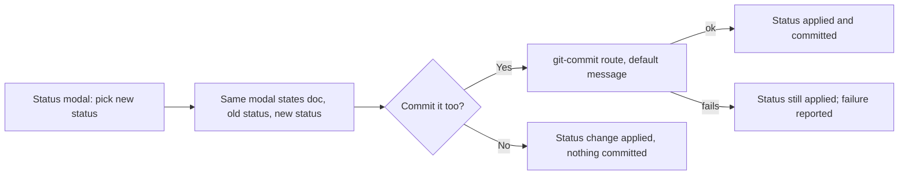

## prod_105_one_step_not_two_for_a_status_change_that_should_be_committed - One step, not two, for a status change that should be committed
> Date: 2026-08-15
> Status: Settled
> Related request: `req_374_confirm_the_status_change_offer_to_commit_it`
> Related backlog: `item_843_show_what_a_status_change_will_do_before_it_lands`
> Related task: `task_385_orchestrate_the_status_confirm_and_commit_work`
> Related architecture: (none yet)
> Reminder: Update status, linked refs, scope, decisions, success signals, and open questions when you edit this doc.
> Indicators reviewed: 2026-08-15 18:51:19

# Overview
Applying a status change and committing it are the same operator intent most of the time; make that the default path instead of two separate actions.

# Goals
- The operator sees what is about to change before it lands.
- Committing the change is offered right where the decision is made, with a default message that needs no thought.
- Declining to commit never blocks or reverts the status change itself.
- Reuse the existing themed modal and git-commit mechanisms rather than building new ones.

# Non-goals
- Batching multiple pending changes into one commit.
- Undo or redo of a status change or its commit.
- Changing what statuses are legal or the state machine's transition rules.
- A confirmation UX for the CLI or MCP tools.

# Scope and guardrails
- In: scaffolded request, product, backlog, orchestration task, validation, and handoff context.
- Out: unrelated workflow docs and implementation of generated tasks.

# Key product decisions
- Use structured input as the source of truth for generated docs.
- Keep generated write paths local and repo-bounded.

# Success signals
- Generated docs pass lint and audit without broad manual rewrites.
- Context-pack output can be handed to an implementation agent directly.

# References
- Product back-reference: `item_843_show_what_a_status_change_will_do_before_it_lands`
- Task back-reference: `task_385_orchestrate_the_status_confirm_and_commit_work`
