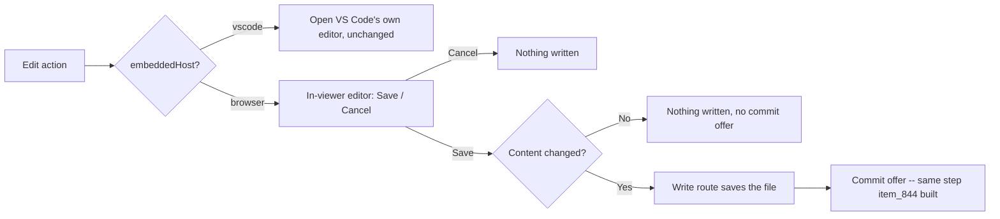

## prod_106_an_editor_that_stays_in_the_browser_it_is_already_in - An editor that stays in the browser it is already in
> Date: 2026-08-15
> Status: Settled
> Related request: `req_375_edit_documents_in_the_browser_viewer`
> Related backlog: `item_845_an_in_viewer_editor_screen_for_the_browser_vs_code_unchanged`
> Related task: `task_386_orchestrate_the_in_browser_document_editor_work`
> Related architecture: (none yet)
> Reminder: Update status, linked refs, scope, decisions, success signals, and open questions when you edit this doc.
> Indicators reviewed: 2026-08-15 19:07:28

# Overview
The standalone browser viewer currently hands editing off to a system editor; give it its own editor screen instead, and let VS Code keep doing what it already does best.

# Goals
- Editing a document in the browser viewer never leaves the browser.
- VS Code's embedded panel is untouched: it keeps opening VS Code's own editor.
- A save that changes the file offers the same commit step a status change offers, not a second mechanism.
- A save that changes nothing writes nothing and offers nothing.

# Non-goals
- A rich or WYSIWYG markdown editor; a plain editable text view is enough.
- Real-time collaborative editing or conflict resolution between two open panels editing the same file.
- Changing anything about the VS Code embedded panel's own editor.
- A second confirm-and-commit mechanism -- this reuses item_844's.

# Scope and guardrails
- In: scaffolded request, product, backlog, orchestration task, validation, and handoff context.
- Out: unrelated workflow docs and implementation of generated tasks.

# Key product decisions
- Use structured input as the source of truth for generated docs.
- Keep generated write paths local and repo-bounded.

# Success signals
- Generated docs pass lint and audit without broad manual rewrites.
- Context-pack output can be handed to an implementation agent directly.

# References
- Product back-reference: `item_845_an_in_viewer_editor_screen_for_the_browser_vs_code_unchanged`
- Task back-reference: `task_386_orchestrate_the_in_browser_document_editor_work`
