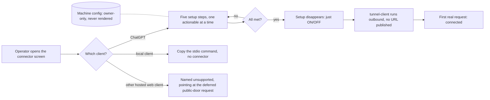

## prod_107_a_connector_configured_once_then_just_on_off - A connector configured once, then just ON/OFF
> Date: 2026-08-15
> Status: Settled
> Related request: `req_376_make_the_chatgpt_mcp_connector_plug_and_play`
> Related backlog: `item_849_fix_the_settings_connector_toggle_and_make_the_connector_screen_reactive`
> Related task: `task_387_deliver_a_durable_chatgpt_native_reactive_mcp_connector`
> Related architecture: `adr_031_one_mcp_transport_per_client_class`
> Reminder: Update status, linked refs, scope, decisions, success signals, and open questions when you edit this doc.
> Indicators reviewed: 2026-08-16 00:27:12

# Overview
The ChatGPT MCP connector worked once it started, but every restart published a new URL and a new bearer token to paste into ChatGPT, and the machine was publicly reachable for as long as it ran. `adr_031_one_mcp_transport_per_client_class` replaced that with one transport per client class: ChatGPT rides OpenAI's Secure MCP Tunnel, which connects outbound and keeps a tunnel ID that never changes; local clients speak stdio and need no connector at all; hosted web clients are named as unsupported rather than half-served. What is left in the viewer is setup that happens once and then a switch, with controls that tell the truth about what is running.

# Goals
- One-time ChatGPT configuration that survives every future stop/start.
- A ChatGPT-native authentication flow, not a no-auth workaround.
- Viewer controls that reflect and drive real connector state without a manual refresh.

# Non-goals
- A multi-user or multi-tenant authorization system -- this remains a single local operator's own machine.
- Refresh tokens or any token lifetime beyond the connector process's own lifetime.
- A new tunnel provider, custom domain, or hosted relay beyond the existing localtunnel-based transport.
- Removing or replacing the existing static bearer token as a supported auth mode -- OAuth is an additional front door onto the same access, not a replacement.

# Scope and guardrails
- In: scaffolded request, product, backlog, orchestration task, validation, and handoff context.
- Out: unrelated workflow docs and implementation of generated tasks.

# Key product decisions
- Use structured input as the source of truth for generated docs.
- Keep generated write paths local and repo-bounded.

# Success signals
- Generated docs pass lint and audit without broad manual rewrites.
- Context-pack output can be handed to an implementation agent directly.

# References
- Product back-reference: `item_849_fix_the_settings_connector_toggle_and_make_the_connector_screen_reactive`
- Task back-reference: `task_387_deliver_a_durable_chatgpt_native_reactive_mcp_connector`
