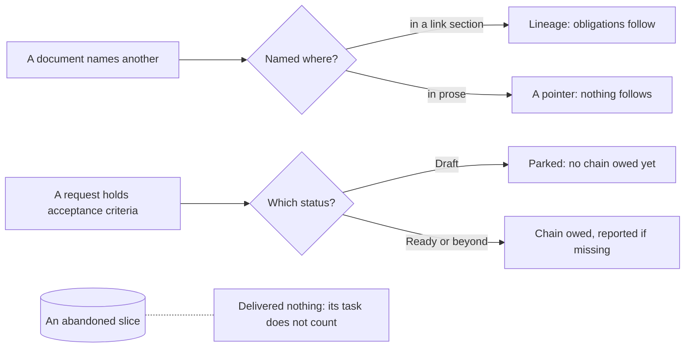

## prod_108_checks_that_read_the_corpus_the_way_it_is_written - Checks that read the corpus the way it is written
> Date: 2026-08-16
> Status: Settled
> Related request: `req_378_stop_reporting_a_deferred_request_and_a_prose_mention_as_corpus_defects`
> Related backlog: `item_852_let_a_draft_request_hold_acceptance_criteria_without_a_chain`
> Related task: `task_388_make_both_checks_read_the_corpus_as_written`
> Related architecture: (none yet)
> Reminder: Update status, linked refs, scope, decisions, success signals, and open questions when you edit this doc.
> Indicators reviewed: 2026-08-16 00:52:58

# Overview
Two Logics checks read a document more literally than it was written: the audit treats a deliberately parked Draft request as an unfinished one, and closeout treats any mention of a request as a promise to deliver it. Both push an author to write less clearly to keep the tooling quiet, which is the opposite of what the corpus is for.

# Goals
- A request can be parked, with its thinking intact, without being reported as broken.
- A document can point at another document without inheriting its obligations.

# Non-goals
- A general link-type system for the corpus.
- Changing what closeout demands of the request a task actually delivers.
- Relaxing acceptance-criteria traceability for delivered work.

# Scope and guardrails
- In: scaffolded request, product, backlog, orchestration task, validation, and handoff context.
- Out: unrelated workflow docs and implementation of generated tasks.

# Key product decisions
- Use structured input as the source of truth for generated docs.
- Keep generated write paths local and repo-bounded.

# Success signals
- Generated docs pass lint and audit without broad manual rewrites.
- Context-pack output can be handed to an implementation agent directly.

# References
- Product back-reference: `item_852_let_a_draft_request_hold_acceptance_criteria_without_a_chain`
- Task back-reference: `task_388_make_both_checks_read_the_corpus_as_written`
