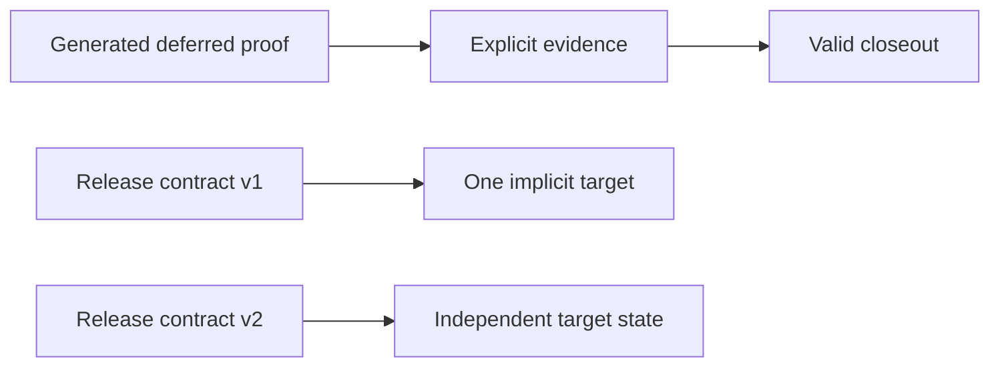

## prod_109_trustworthy_closeout_and_release_contracts - Trustworthy closeout and release contracts
> Date: 2026-08-22
> Status: Proposed
> Related request: `req_379_make_release_and_closeout_workflow_contracts_convergent_across_targets`
> Related backlog: `item_854_make_generated_ac_traceability_promotable_at_closeout`, `item_855_add_target_scoped_release_contracts_and_evidence`
> Related task: `task_389_deliver_convergent_closeout_repair_and_multi_target_release_contracts`
> Related architecture: (none yet)
> Reminder: Update status, linked refs, scope, decisions, success signals, and open questions when you edit this doc.
> Indicators reviewed: 2026-08-22 13:06:50

# Overview
The workflow must converge from its generated documents and command guidance to a valid closeout, and it must represent every releasable artefact a project actually ships. A gate that cannot be satisfied through its own supported path is a production defect; a single-target release model must not make an additional artefact invisible.

# Goals
- Make the existing AC proof repair path safe and usable at closeout.
- Preserve authored proof and avoid fabricated validation evidence.
- Provide target-scoped release state and evidence while retaining zero-migration support for single-target projects.

# Non-goals
- Adding a second proof-authoring interface to `flow closeout`.
- Automatically inventing acceptance-proof text or validation results.
- Migrating existing release contracts or forcing release targets on a single-target project.
- Building generic contract inheritance or configuration templating in the first multi-target release.

# Scope and guardrails
- In: scaffolded request, product, backlog, orchestration task, validation, and handoff context.
- Out: unrelated workflow docs and implementation of generated tasks.

# Key product decisions
- Proof repair may promote only the exact generated placeholder and only when the caller supplies or has recorded evidence; it never invents proof.
- Release v2 is additive: v1 remains a single implicit target, while mutations in a multi-target contract select an explicit target.
- Target status and evidence are isolated across CLI, context packs, MCP, and viewer surfaces.

# Success signals
- Generated docs pass lint and audit without broad manual rewrites.
- Context-pack output can be handed to an implementation agent directly.

# References
- Product back-reference: `req_379_make_release_and_closeout_workflow_contracts_convergent_across_targets`
- Task back-reference: `task_389_deliver_convergent_closeout_repair_and_multi_target_release_contracts`
