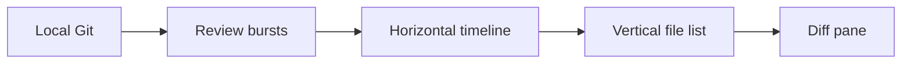

## prod_110_a_review_slot_for_project_change_timelines - A Review slot for project change timelines
> Date: 2026-08-22
> Status: Settled
> Related request: `req_381_add_a_review_slot_for_project_change_timelines`
> Related backlog: `item_857_expose_review_bursts_from_local_git`
> Related task: `task_393_orchestrate_the_review_slot_change_timeline`
> Related architecture: (none yet)
> Reminder: Update status, linked refs, scope, decisions, success signals, and open questions when you edit this doc.
> Indicators reviewed: 2026-08-23 13:56:45

# Overview
Add a dedicated Review surface to the Logics viewer where operators can read project changes as bursts over time: move horizontally through the working tree and recent commits, move vertically through files in the selected burst, and inspect the selected diff without leaving the viewer.

# Goals
- Make project change review a first-class viewer workflow instead of a hidden part of the Git cockpit.
- Let operators navigate changes spatially: time left-to-right, files top-to-bottom, diff in the main pane.
- Reuse local Git and existing diff rendering for the first version.
- Keep the surface read-only, bounded, keyboard-reachable, and responsive.

# Non-goals
- A custom filesystem watcher, persistent event store, or live session recorder.
- Remote GitHub, GitLab, pull request, or CI review APIs.
- Git mutation actions such as commit, checkout, reset, revert, or cherry-pick.
- A branch graph, blame view, merge conflict editor, or full code review system.
- Replacing the existing Git cockpit.

# Scope and guardrails
- In: a first-class Review viewer slot backed by bounded local Git data, with working-tree and recent-commit bursts, per-file selection, diff preview, keyboard navigation, responsive layout, and focused tests.
- Out: filesystem watchers, remote provider review APIs, Git mutation actions, persistent review history, branch graphs, blame, or replacing the Git cockpit.

# UX shape
- Navigation: Review is the third project surface beside Activity and Project, not another Remote submenu. The current Activity/Project switcher becomes Activity/Project/Review.
- Desktop: the burst rail spans the top, the file list sits left, and the diff pane owns the remaining width.
- Tablet: the rail stays on top; the file list and diff pane keep scan order without introducing page-level horizontal scroll.
- Phone: the page keeps one vertical scroll axis; only the burst rail may scroll horizontally inside its own region.
- State: selected burst and selected file use shape/position and `aria-current` or equivalent, not colour alone.
- Empty states: clean, unavailable, non-repository, failed, and truncated states each explain themselves in the region that would otherwise be blank.

# Key product decisions
- Start from local Git because the existing viewer already has safe, bounded Git payloads and diff rendering.
- Treat the working tree as the first timeline burst only when it is dirty.
- Add per-file commit diffs because whole-commit patches are too coarse for vertical file navigation.
- Prove Review in the existing visual campaign so layout defects are caught with the same checks as the other viewer screens.

# Success signals
- Operators can review uncommitted changes and recent commits from one Review slot without leaving the viewer.
- Arrow keys move through bursts and files in the same directions the layout communicates.
- Clean, empty, unavailable, and oversized states are readable instead of breaking the screen.
- The desktop, tablet, and phone captures show the selected burst, selected file, and diff context without overlap, clipped controls, or sideways page scroll.

# References
- Product back-reference: `item_857_expose_review_bursts_from_local_git`
- Task back-reference: `task_393_orchestrate_the_review_slot_change_timeline`
