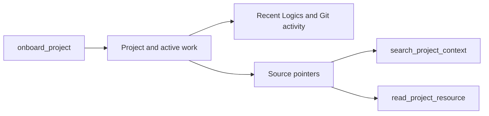

## prod_111_connector_project_onboarding_context - Connector project onboarding context
> Date: 2026-08-23
> Status: Proposed
> Related request: `req_382_make_the_chatgpt_mcp_connector_self_onboard_onto_any_logics_project`
> Related backlog: `item_859_expose_one_read_only_onboard_project_mcp_tool`, `item_860_add_bounded_project_discovery_and_targeting_for_connector_sessions`, `item_861_aggregate_recent_logics_and_git_activity_for_onboarding`, `item_862_expose_source_backed_project_context_search_and_resource_reads`
> Related task: `task_394_orchestrate_connector_project_onboarding_context`
> Related architecture: (none yet)
> Reminder: Update status, linked refs, scope, decisions, success signals, and open questions when you edit this doc.

# Overview
Give the ChatGPT MCP connector a small, reliable project-onboarding surface: one read-only call tells the model where it is, what Logics work is active, what changed recently, what it can read next, and how to target another project. The context stays derived from Logics and Git instead of becoming a manually maintained assistant summary.

# Goals
- Make the first connector call answer 'what project and active work can I actually see?' with evidence.
- Expose semantic project context without giving the model broad, unbounded repository access.
- Let the model navigate projects and deepen context through sourced, bounded follow-up calls.
- Keep implementation on existing Logics Manager primitives: status, sync/context-pack, viewer project registry, MCP dispatch, and Git viewer helpers.

# Non-goals
- A free-form AI-written project encyclopedia.
- A full source-code indexing engine or vector database.
- New authentication behavior for the connector; durability/OAuth/toggle work belongs to the existing connector request.
- Mutating workflow docs, changing active tasks, or editing project files from onboarding tools.
- Guaranteeing perfect architecture understanding from one call; the first version provides enough sourced context to ask and answer responsibly.

# Scope and guardrails
- In: scaffolded request, product, backlog, orchestration task, validation, and handoff context.
- Out: unrelated workflow docs and implementation of generated tasks.

# Key product decisions
- Use structured input as the source of truth for generated docs.
- Keep generated write paths local and repo-bounded.

# Success signals
- Generated docs pass lint and audit without broad manual rewrites.
- Context-pack output can be handed to an implementation agent directly.

# References
- Product back-reference: `req_382_make_the_chatgpt_mcp_connector_self_onboard_onto_any_logics_project`
- Task back-reference: `task_394_orchestrate_connector_project_onboarding_context`
