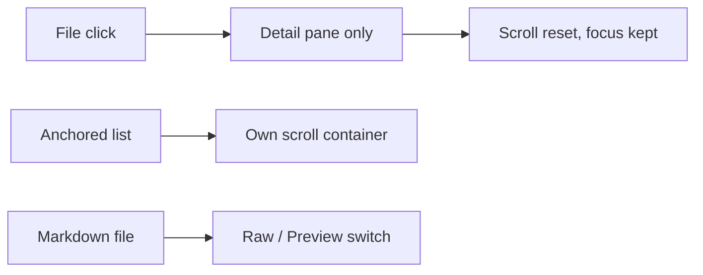

## prod_112_an_anchored_explorer_with_a_readable_detail_pane - An anchored Explorer with a readable detail pane
> Date: 2026-08-23
> Status: Settled
> Related request: `req_383_rework_the_explorer_screen_into_an_anchored_file_list_with_an_independent_detail_pane`
> Related backlog: `item_863_anchor_the_explorer_list_and_split_its_scroll_from_the_detail`
> Related task: `task_395_orchestrate_the_explorer_layout_and_markdown_preview_rework`
> Related architecture: (none yet)
> Reminder: Update status, linked refs, scope, decisions, success signals, and open questions when you edit this doc.
> Indicators reviewed: 2026-08-23 14:05:36

# Overview
Make the Explorer behave like a file browser rather than a page that reloads: a list anchored to the left that stays put while the operator reads, a detail pane that owns its own scroll and starts each file at the top, and a rendered view for the markdown files most of this repository is written in.

# Goals
- Keep the operator's place in the file list across every file they open.
- Give the detail pane its own scroll so long files never push the list away.
- Make markdown readable as rendered output without leaving the Explorer.
- Reuse the markdown renderer, code viewer, and preference storage that already exist rather than adding surfaces.

# Non-goals
- An expandable nested tree or recursive directory loading.
- Keyboard traversal of the file list.
- A draggable splitter, list virtualisation, or a breadcrumb redesign.
- Editing, creating, renaming, or deleting files from the Explorer.
- Changing the workspace tree or preview payloads served by the backend.

# Scope and guardrails
- In: scaffolded request, product, backlog, orchestration task, validation, and handoff context.
- Out: unrelated workflow docs and implementation of generated tasks.

# Key product decisions
- Use structured input as the source of truth for generated docs.
- Keep generated write paths local and repo-bounded.

# Success signals
- Generated docs pass lint and audit without broad manual rewrites.
- Context-pack output can be handed to an implementation agent directly.

# References
- Product back-reference: `item_863_anchor_the_explorer_list_and_split_its_scroll_from_the_detail`
- Task back-reference: `task_395_orchestrate_the_explorer_layout_and_markdown_preview_rework`
