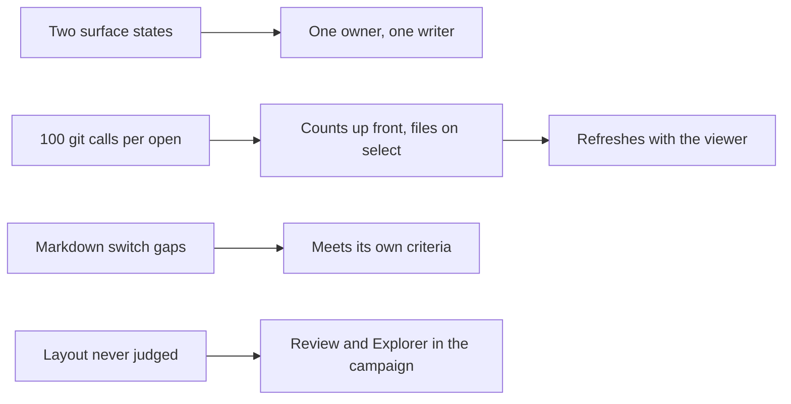

## prod_113_one_viewer_surface_state_and_a_review_timeline_that_can_refresh - One viewer surface state and a Review timeline that can refresh
> Date: 2026-08-23
> Status: Proposed
> Related request: `req_384_repair_the_review_slot_and_explorer_delivery_against_the_acceptance_criteria_they_closed_on`
> Related backlog: `item_866_unify_the_viewer_surface_state_across_the_shared_web_client`, `item_867_make_the_review_bursts_payload_lazy_refreshable_and_failure_safe`, `item_868_fix_review_timeline_keyboard_navigation`, `item_869_finish_the_explorer_markdown_switch_and_pane_sizing`, `item_870_cover_review_and_the_reworked_explorer_in_the_visual_campaign`
> Related task: `task_396_orchestrate_the_review_and_explorer_repair`
> Related architecture: (none yet)
> Reminder: Update status, linked refs, scope, decisions, success signals, and open questions when you edit this doc.
> Indicators reviewed: 2026-08-23 14:30:21

# Overview
The Review slot and the Explorer rework shipped, and both left criteria unmet: the viewer runs two competing surface states, opening Review costs a hundred Git subprocesses so it was never wired to refresh, and the Explorer markdown switch misses file types, states, and the shared preference store. This closes the gap between what those requests promised and what runs.

# Goals
- Leave the viewer with one surface state that every layer reads and writes.
- Make the Review timeline cheap enough to refresh with the rest of the viewer, and then refresh it.
- Finish the Explorer markdown switch against the criteria it was accepted on.
- Put the new surfaces under the layout harness that was supposed to judge them.

# Non-goals
- New Review or Explorer capability of any kind.
- The seven pre-existing visual campaign failures in workshop commands, cdx, and the request modal.
- Reworking the shared web client's state model beyond unifying the surface.
- Changing the Git payload contracts that were not part of this delivery.

# Scope and guardrails
- In: scaffolded request, product, backlog, orchestration task, validation, and handoff context.
- Out: unrelated workflow docs and implementation of generated tasks.

# Key product decisions
- Use structured input as the source of truth for generated docs.
- Keep generated write paths local and repo-bounded.

# Success signals
- Generated docs pass lint and audit without broad manual rewrites.
- Context-pack output can be handed to an implementation agent directly.

# References
- Product back-reference: `req_384_repair_the_review_slot_and_explorer_delivery_against_the_acceptance_criteria_they_closed_on`
- Task back-reference: `task_396_orchestrate_the_review_and_explorer_repair`
