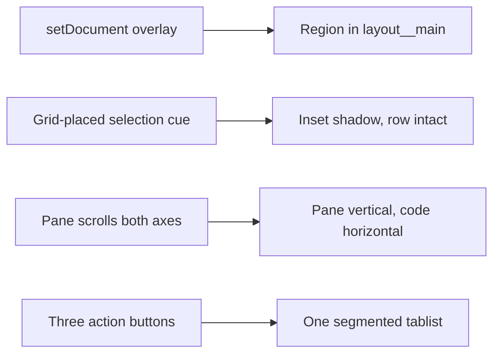

## prod_114_review_as_a_real_viewer_surface - Review as a real viewer surface
> Date: 2026-08-23
> Status: Proposed
> Related request: `req_385_render_review_in_the_main_pane_and_repair_the_explorer_detail_pane_and_surface_control`
> Related backlog: `item_871_move_review_from_the_screen_overlay_into_the_main_pane`, `item_872_repair_the_explorer_selected_row_and_detail_pane_scrolling`, `item_873_turn_the_surface_buttons_into_one_segmented_control`
> Related task: `task_397_orchestrate_the_review_main_pane_move_and_the_explorer_and_control_repairs`
> Related architecture: (none yet)
> Reminder: Update status, linked refs, scope, decisions, success signals, and open questions when you edit this doc.
> Indicators reviewed: 2026-08-23 15:40:30

# Overview
Review shipped as a floating screen because it was wired through the screen renderer instead of the main pane. This puts it where Activity and Project live, and repairs the two Explorer defects and the surface control that operator testing found alongside it.

# Goals
- Make Review behave like the surface it was specified as.
- Leave the Explorer detail pane readable and stable.
- Give the three surfaces one control that reads as one choice.

# Non-goals
- Changing the Review timeline's data, rendering or keyboard behavior.
- Changing the Explorer's selection and scroll behavior, which is correct.
- Reworking the screen pattern used by Workshop, Git, CDX and Insights.
- The seven pre-existing visual campaign failures.

# Scope and guardrails
- In: scaffolded request, product, backlog, orchestration task, validation, and handoff context.
- Out: unrelated workflow docs and implementation of generated tasks.

# Key product decisions
- Use structured input as the source of truth for generated docs.
- Keep generated write paths local and repo-bounded.

# Success signals
- Generated docs pass lint and audit without broad manual rewrites.
- Context-pack output can be handed to an implementation agent directly.

# References
- Product back-reference: `req_385_render_review_in_the_main_pane_and_repair_the_explorer_detail_pane_and_surface_control`
- Task back-reference: `task_397_orchestrate_the_review_main_pane_move_and_the_explorer_and_control_repairs`
