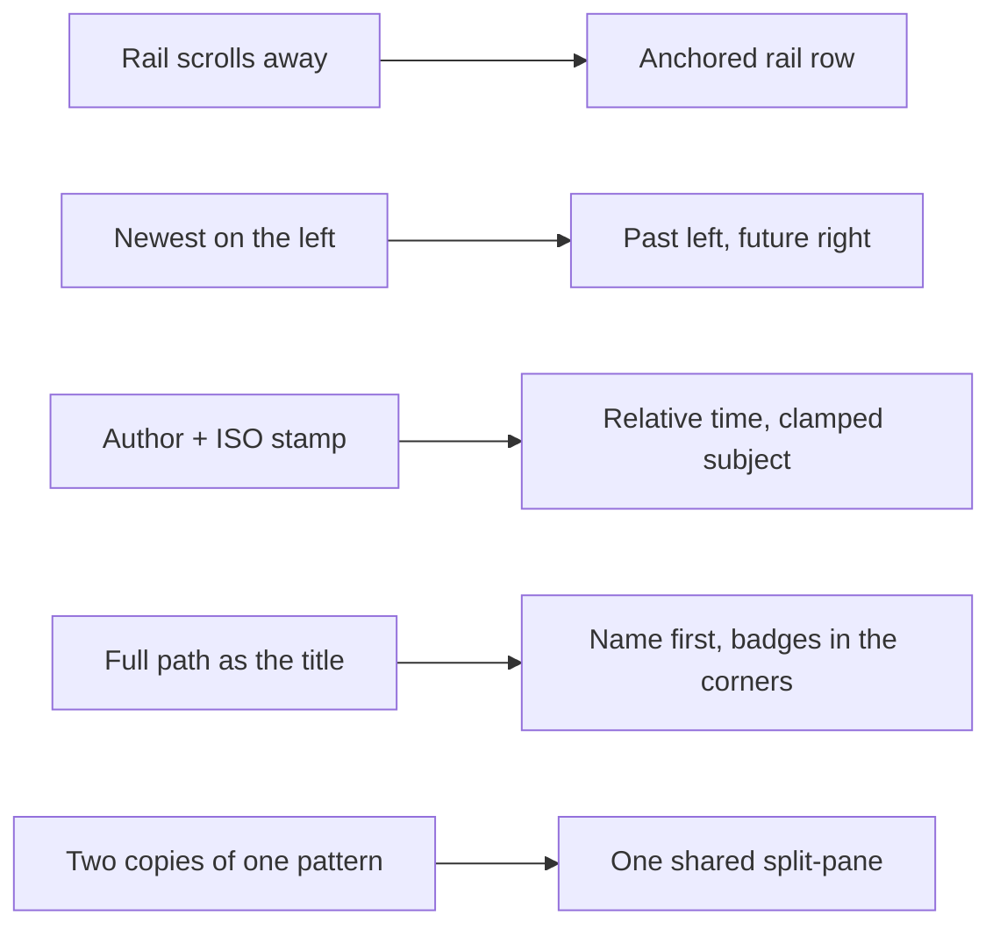

## prod_115_a_review_timeline_that_reads_like_a_timeline - A Review timeline that reads like a timeline
> Date: 2026-08-23
> Status: Settled
> Related request: `req_386_make_the_review_timeline_readable_an_anchored_rail_denser_tiles_and_the_shared_split_pane`
> Related backlog: `item_874_anchor_the_review_rail_and_make_its_tiles_a_past_to_future_timeline`
> Related task: `task_398_orchestrate_the_review_timeline_reading_ergonomics`
> Related architecture: (none yet)
> Reminder: Update status, linked refs, scope, decisions, success signals, and open questions when you edit this doc.
> Indicators reviewed: 2026-08-23 16:40:37

# Overview
The Review surface shipped with its navigation scrolling away, its tiles spending vertical space on an author and a full timestamp, time running backwards, and a diff pane that scrolls as one block. This makes the rail an anchored, dense, past-to-future timeline, gives changed files a name-first row with corner badges, and puts the diff on the same anchored list-and-detail pattern the Explorer uses.

# Goals
- Keep the navigation on screen while the operator reads what it navigates to.
- Show more of the timeline in less space, and show that it continues.
- Put uncommitted work where the eye expects it: between the last commit and the next.
- Make a changed file identifiable by name, with its metadata out of the way.
- Have one list-and-detail pattern in the viewer, not two copies of one.

# Non-goals
- Changing how bursts or diffs are computed beyond the author and timestamp fields.
- Changing the keyboard model.
- Making the ghost tiles navigable or predictive in any way.
- The seven pre-existing visual campaign findings.

# Scope and guardrails
- In: scaffolded request, product, backlog, orchestration task, validation, and handoff context.
- Out: unrelated workflow docs and implementation of generated tasks.

# Key product decisions
- Use structured input as the source of truth for generated docs.
- Keep generated write paths local and repo-bounded.

# Success signals
- Generated docs pass lint and audit without broad manual rewrites.
- Context-pack output can be handed to an implementation agent directly.

# References
- Product back-reference: `item_874_anchor_the_review_rail_and_make_its_tiles_a_past_to_future_timeline`
- Task back-reference: `task_398_orchestrate_the_review_timeline_reading_ergonomics`
