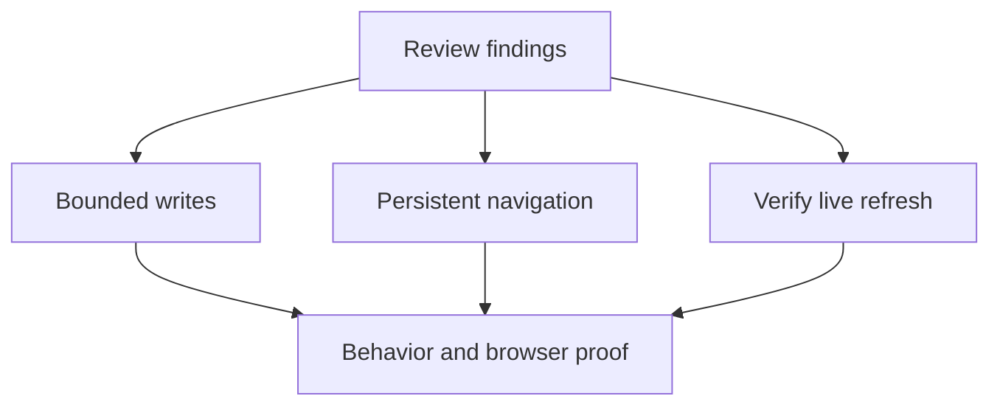

## prod_116_trustworthy_viewer_actions_and_persistent_project_navigation - Trustworthy viewer actions and persistent project navigation
> Date: 2026-09-09
> Status: Proposed
> Related request: `req_387_review_findings_literal_git_paths_repair_input_validation_and_update_cache_resilience`
> Related backlog: item_877_commit_only_literal_selected_git_paths, item_878_reject_malformed_repair_requests_before_writing, item_879_recover_safely_from_invalid_update_caches, item_880_synchronize_the_surface_selector_after_adding_a_project, item_881_restore_fleet_discovery_roots_and_existing_favorites_on_reopen, item_882_investigate_review_refresh_while_the_surface_stays_open, item_883_clarify_the_fleet_root_selection_experience, item_884_contain_grouped_recent_activity_within_the_viewport
> Related task: `task_399_deliver_the_repository_review_fixes_and_viewer_followups`
> Related architecture: (none yet)
> Reminder: Update status, linked refs, scope, decisions, success signals, and open questions when you edit this doc.
> Indicators reviewed: 2026-09-09 12:06:05

# Overview
Operators must be able to trust selected writes and retain their project navigation context between viewer sessions. This brief frames the eight findings in req_387, including investigation before fixing the uncertain Review refresh report.

# Goals
- Commit only selected files and reject malformed repair input before writing.
- Keep optional update checks from breaking normal usage.
- Keep the displayed surface and selector aligned, with grouped activity content contained within the available view width.
- Restore Fleet discovery roots and favorites on reopening.
- Make Fleet root and individual project selection understandable and establish the actual Review refresh behavior.

# Non-goals
- No new viewer framework, storage service or polling architecture.
- No change to the accepted return to Activity after project addition.
- No assumed favorite data loss or assumed Review refresh defect.
- No release, push or dependency-policy exception as part of corpus preparation.

# Scope and guardrails
- In: the eight req_387 findings, regression checks, focused browser evidence and affected documentation.
- Out: unrelated refactors and speculative features.
- Reuse existing Git, JSON parsing, preference and refresh paths; preserve trust-boundary validation, accessibility and valid current behaviors.

# Key product decisions
- Deliver the two confirmed mutation defects first.
- Root reset restoring favorites is evidence for investigating discovery context restoration, not rebuilding favorites.
- F6 can close through a documented refutation; a fix requires reproduction.
- Use task-oriented picker copy and distinct browsing, confirmation and cancellation actions.
- Treat existing dependency audit failures separately from feature validation; do not hide or waive them.

# Success signals
- Real temporary Git commits match the selected literal files.
- Invalid repair requests leave document bytes unchanged.
- Invalid cache content cannot interrupt supported callers.
- Browser evidence shows synchronized tabs and retained roots/projects/favorites after reopening.
- Review refresh behavior is established with measured waiting and repository changes.
- Both folder pickers are usable with keyboard navigation and at a constrained viewport.
- Collapsed and expanded Activity chains do not cause page-level horizontal overflow.

# References
- Product back-reference: (none yet)
- Task back-reference: `task_399_deliver_the_repository_review_fixes_and_viewer_followups`
