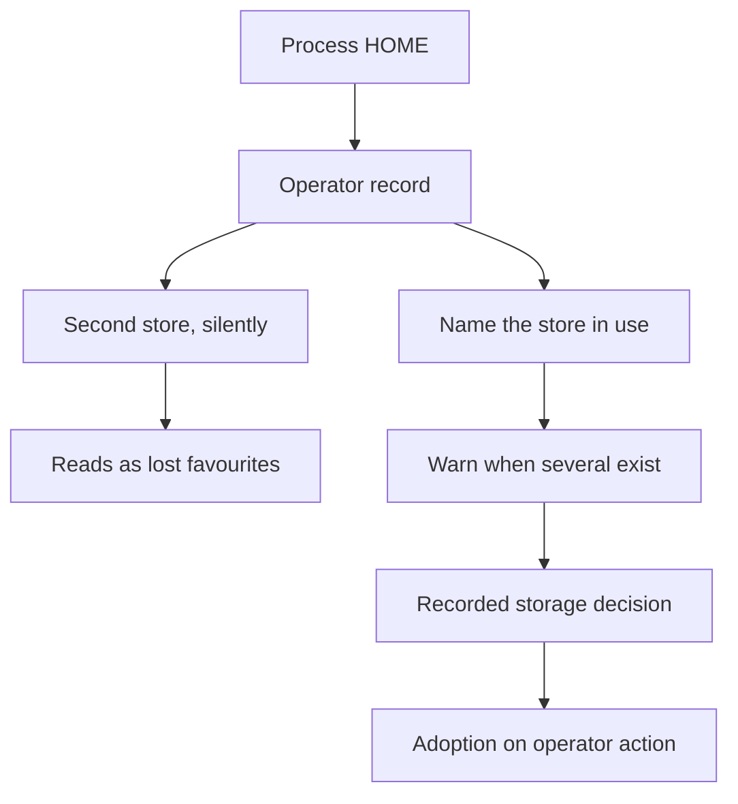

## prod_117_one_operator_record_and_the_viewer_says_which_one_it_opened - One operator record, and the viewer says which one it opened
> Date: 2026-09-09
> Status: Proposed
> Related request: `req_388_say_which_operator_preference_store_the_viewer_is_using_and_stop_it_forking_silently`
> Related backlog: `item_885_report_which_preference_store_the_viewer_opened`, `item_886_decide_where_the_operator_record_belongs_and_adopt_an_existing_one_deliberately`
> Related task: `task_400_make_the_operator_preference_store_visible_then_decide_where_it_belongs`
> Related architecture: (none yet)
> Reminder: Update status, linked refs, scope, decisions, success signals, and open questions when you edit this doc.

# Overview
Where the operator's own record lives - favorites, last-used projects, fleet discovery roots, refresh interval - is currently a consequence of the process HOME rather than a decision. Make the store the viewer opened a stated fact, and settle deliberately whether that record should follow HOME or live in one place, without ever merging or overwriting a store behind the operator's back.

# Goals
- State which operator record the running viewer opened, wherever it already states what it is.
- Report a forked record as an environment finding instead of leaving it to look like lost data.
- Settle the storage question on recorded evidence, not by whichever code path ran first.
- Let an operator reach a record that forked, through the viewer, without hand-editing JSON.

# Non-goals
- Synchronising preferences between machines.
- Merging two stores automatically.
- Changing what the record contains or how its two scopes are split, which prod_116 already covers.
- Relocating TLS material or the paired-device registry, which are keyed the same way but are their own decision.

# Scope and guardrails
- In: scaffolded request, product, backlog, orchestration task, validation, and handoff context.
- Out: unrelated workflow docs and implementation of generated tasks.

# Key product decisions
- Use structured input as the source of truth for generated docs.
- Keep generated write paths local and repo-bounded.

# Success signals
- Generated docs pass lint and audit without broad manual rewrites.
- Context-pack output can be handed to an implementation agent directly.

# References
- Product back-reference: `req_388_say_which_operator_preference_store_the_viewer_is_using_and_stop_it_forking_silently`
- Task back-reference: `task_400_make_the_operator_preference_store_visible_then_decide_where_it_belongs`
