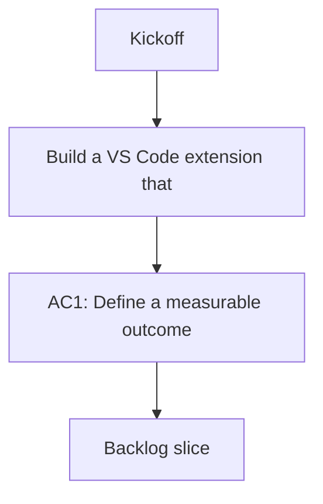

## req_000_kickoff - Kickoff
> From version: 1.9.1
> Understanding: 93% (audit-aligned)
> Confidence: 88% (governed)
> Status: Done

# Needs
- Build a VS Code extension that provides a visual workspace to orchestrate everything in `logics` (requests, backlog, tasks, specs, etc.).

# Context
- The goal is to manage and visualize the Logics flow directly inside VS Code, without leaving the editor.
- The extension should read and write the existing `logics/*` Markdown files and folders.

# Clarifications
- Define the minimum v1 features. :: Read-only explorer + detail panel; optional create/promote later.
- Define the primary views. :: Flow board (Request → Backlog → Task → Spec) and a detail editor/preview.
- Define how items are parsed from Markdown. :: Use filename + front-matter-like header lines; avoid strict schema for v1.
- Define actions supported in v1. :: Open file, promote item via scripts, and refresh index.
- Define the source of truth. :: Files on disk under `logics/*` are canonical.
- Define empty states and errors. :: Show onboarding tips if no items; show file-level errors inline.

# Definition of Ready (DoR)
- [x] Problem statement is explicit and user impact is clear.
- [x] Scope boundaries are intentionally minimal for this kickoff request.
- [x] Acceptance direction is clear enough to start delivery.
- [x] Dependencies and known constraints are captured where relevant.

# Backlog
- `logics/backlog/item_000_kickoff.md`

# Companion docs
- Product brief(s): (none yet)
- Architecture decision(s): (none yet)
