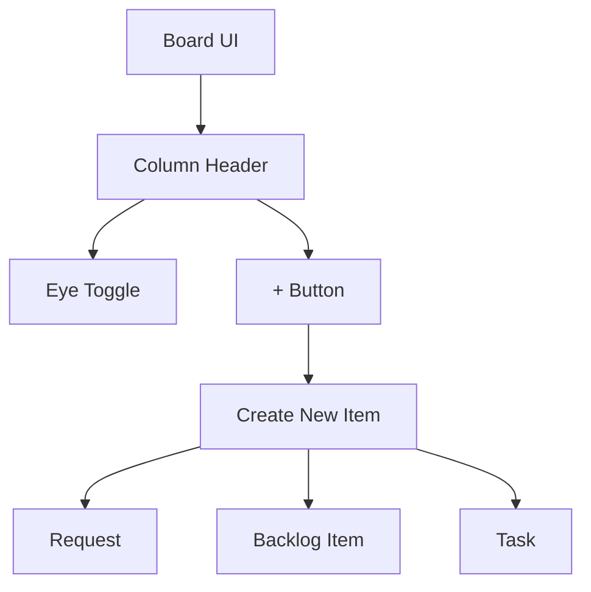

## req_001_add_column_add_button - Add “+” action in column headers
> From version: 1.9.1 (refreshed)
> Understanding: 88% (audit-aligned)
> Confidence: 93% (governed)
> Status: Done

# Needs
- Add a “+” button in each column header, positioned to the left of the eye toggle, to create new Logics items (Request, Backlog item, or Task).

# Context
- The flow board already has column headers with a visibility (eye) toggle.
- Users want a quick, in-place way to create new items directly from the board UI.

# Clarifications
- The “+” button shows a choice between creating: Request, Backlog item, or Task.
- The “+” icon should be placed to the left of the eye icon in the column header.
- The action should be accessible from any column (same options everywhere), unless later scoped.
- Remove the “New Request” button from the top header once this change is complete.
- Rename the “Open” button in the details actions to “Edit”.

# Definition of Ready (DoR)
- [x] Problem statement is explicit and user impact is clear.
- [x] Scope boundaries are explicit enough for delivery.
- [x] Acceptance direction is clear enough to start delivery.
- [x] Dependencies and known constraints are captured where relevant.

# Backlog
- `logics/backlog/item_001_add_column_add_button.md`

# Companion docs
- Product brief(s): (none yet)
- Architecture decision(s): (none yet)
