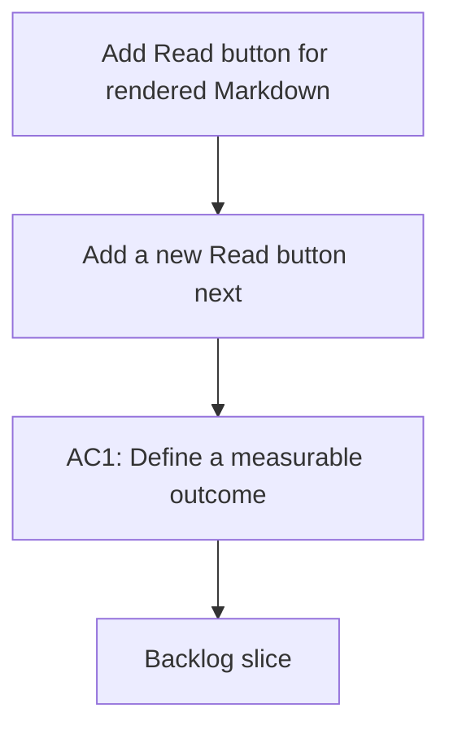

## req_002_add_read_button - Add Read button for rendered Markdown
> From version: 1.9.1
> Understanding: 83% (audit-aligned)
> Confidence: 93% (governed)
> Status: Done

# Needs
- Add a new “Read” button next to the “Edit” button in the details actions.
- “Read” should open a rendered Markdown view of the target file, ideally in VS Code’s main editor area.

# Context
- The details panel currently exposes quick actions (e.g., Edit/Open, Promote).
- Users want a read-only, formatted view of the Markdown content without leaving the editor.

# Clarifications
- The “Read” action should render the Markdown (not raw text) for the selected item.
- Prefer opening the rendered view in the main editor (tab) rather than inside the panel.
- If no item is selected, the “Read” button stays disabled.

# Definition of Ready (DoR)
- [x] Problem statement is explicit and user impact is clear.
- [x] Scope boundaries are explicit enough for delivery.
- [x] Acceptance direction is clear enough to start delivery.
- [x] Dependencies and known constraints are captured where relevant.

# Backlog
- `logics/backlog/item_002_add_read_button.md`

# Companion docs
- Product brief(s): (none yet)
- Architecture decision(s): (none yet)
