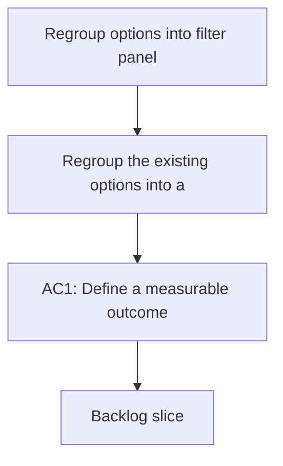

## req_003_filter_panel_options - Regroup options into filter panel
> From version: 1.9.1
> Understanding: 88% (audit-aligned)
> Confidence: 88% (governed)
> Status: Done

# Needs
- Regroup the existing options into a dedicated panel that opens when clicking a filter-like icon.

# Context
- The toolbar currently exposes options as inline toggles.
- The goal is to declutter the header while keeping quick access to options.

# Clarifications
- Clicking the filter icon opens a panel containing the options.
- The filter icon button sits on the same row as the buttons but is docked to the left side of the panel.
- The panel should contain the current options (e.g., Hide used requests, Hide completed), unless otherwise specified later.

# Definition of Ready (DoR)
- [x] Problem statement is explicit and user impact is clear.
- [x] Scope boundaries are explicit enough for delivery.
- [x] Acceptance direction is clear enough to start delivery.
- [x] Dependencies and known constraints are captured where relevant.

# Backlog
- `logics/backlog/item_003_filter_panel_options.md`

# Companion docs
- Product brief(s): (none yet)
- Architecture decision(s): (none yet)
