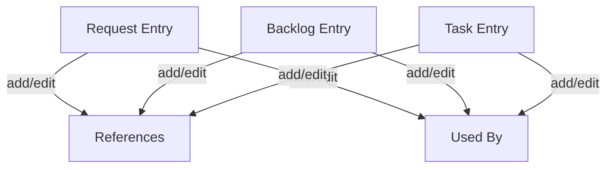

## req_004_add_references_and_used_by_links - Add references and used-by links on request/backlog/task entries
> From version: 1.9.1 (refreshed)
> Understanding: 93% (audit-aligned)
> Confidence: 93% (governed)
> Status: Done

# Needs
- Allow adding and editing `References` and/or `Used by` links on entries in Request, Backlog, and Task stages.

# Context
- The details panel already displays references and reverse usage relations when detected from Markdown content.
- Users need to manually enrich those links to keep traceability complete across entries.

# Clarifications
- Add a way to attach one or more reference links to any entry (`request`, `backlog`, `task`).
- Support adding `Used by` links as well, including when no automatic promotion link exists.
- Keep compatibility with existing relation formats already parsed in Markdown files.
- Changes should update the underlying Markdown file (source of truth) and refresh the board view.

# Definition of Ready (DoR)
- [x] Problem statement is explicit and user impact is clear.
- [x] Scope boundaries are explicit enough for delivery.
- [x] Acceptance direction is clear enough to start delivery.
- [x] Dependencies and known constraints are captured where relevant.

# Backlog
- `logics/backlog/item_004_add_references_and_used_by_links.md`

# Companion docs
- Product brief(s): (none yet)
- Architecture decision(s): (none yet)
