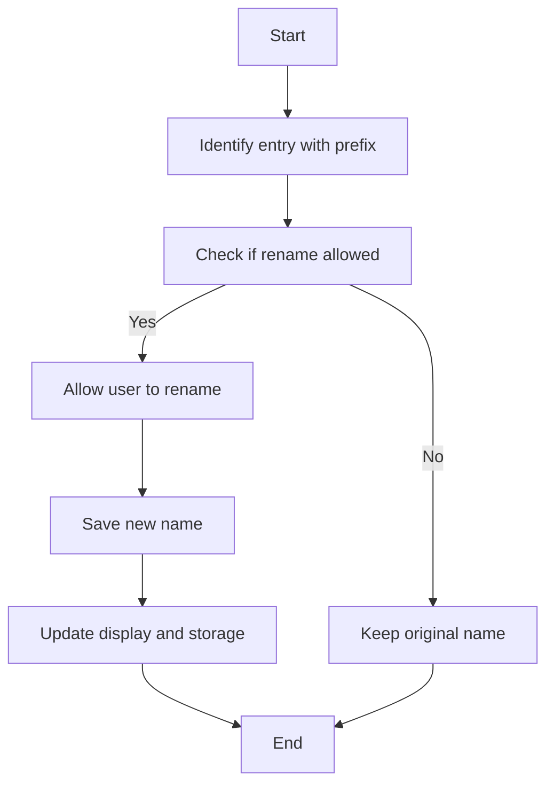

## req_005_rename_entry_name_suffix - Allow renaming request/backlog/task entry names
> From version: 1.9.1 (refreshed)
> Understanding: 98% (audit-aligned)
> Confidence: 93% (governed)
> Status: Done

# Needs
- Give users the ability to rename entry names for `request`, `item`, and `task`.

# Context
- Entry filenames follow an identifier pattern with an immutable prefix (`<type>_<num>_...`).
- Users currently cannot adjust naming after creation, which makes refinement and readability harder over time.

# Clarifications
- Only allow editing the suffix part after `<type>_<num>_` (example: `item_012_<editable-name>`).
- Keep `<type>_<num>_` unchanged during rename.
- Trigger rename from a CTA in the details page, ideally an edit/pencil icon near the current name.
- Persist rename in the source Markdown file and refresh the board/details view.
- Propagate the new name anywhere it is displayed or referenced by the extension.

# Definition of Ready (DoR)
- [x] Problem statement is explicit and user impact is clear.
- [x] Scope boundaries are explicit enough for delivery.
- [x] Acceptance direction is clear enough to start delivery.
- [x] Dependencies and known constraints are captured where relevant.

# Backlog
- `logics/backlog/item_005_rename_entry_name_suffix.md`

# Companion docs
- Product brief(s): (none yet)
- Architecture decision(s): (none yet)
