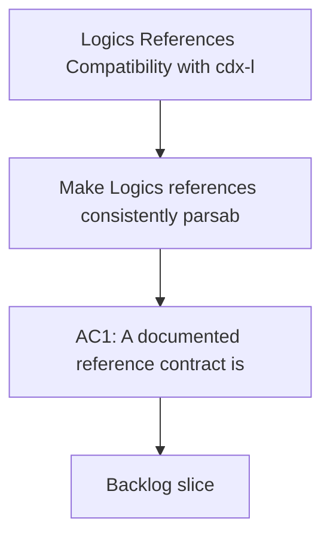

## req_007_logics_references_compatibility_with_cdx_logics_vscode - Logics References Compatibility with cdx-logics-vscode
> From version: 1.9.1
> Status: Done
> Understanding: 100% ((audit-aligned); refreshed)
> Confidence: 100% (governed)
> Complexity: Medium-High
> Theme: Logics Workflow Indexing
> Reminder: Update status/understanding/confidence and references when you edit this doc.

# Needs
- Make Logics references consistently parsable and visible in the plugin details panel.
- Align request/backlog/task lineage with promotion guardrails to prevent false "promotable" states.
- Reduce ambiguity caused by mixed reference formats across docs.

# Context
The extension indexer currently infers links from:
- explicit markers: `Promoted from \`...\`` and `Derived from \`...\``,
- section links in `# References`, `# Used by`, and `# Backlog`.

Observed workflow issue:
- historical docs often keep links under free-form notes or implicit text;
- lineage markers are not always present in tasks/backlog entries;
- this can degrade `References`, `Used by`, and `isPromoted` behavior in the board.

A clear reference contract is needed so markdown remains source-of-truth and plugin rendering remains reliable.

# Acceptance criteria
- AC1: A documented reference contract is defined for request/backlog/task docs.
  - It specifies mandatory sections/markers and expected markdown patterns.
- AC2: Plugin-indexed references (`from`, `manual`, `backlog`) are reproducible on sample docs using the new contract.
- AC3: Promotion state reflects real lineage for migrated examples.
  - Request already linked to backlog is not shown as promotable.
  - Backlog already linked to task is not shown as promotable.
- AC4: A migration approach for legacy docs is defined (incremental or scripted) without losing context.
- AC5: Validation notes include how to verify results from the board and details panel.

# Scope
- In:
  - Reference grammar definition for Logics docs.
  - Compatibility rules for lineage markers and section links.
  - Validation checklist for plugin rendering consistency.
- Out:
  - Full historical rewrite in one batch.
  - Unrelated UI feature work.

# Definition of Ready (DoR)
- [x] Problem statement is explicit and user impact is clear.
- [x] Scope boundaries (in/out) are explicit.
- [x] Acceptance criteria are testable.
- [x] Dependencies and known risks are listed.

# Backlog
- `logics/backlog/item_007_logics_references_compatibility_with_cdx_logics_vscode.md`

# Companion docs
- Product brief(s): (none yet)
- Architecture decision(s): (none yet)
