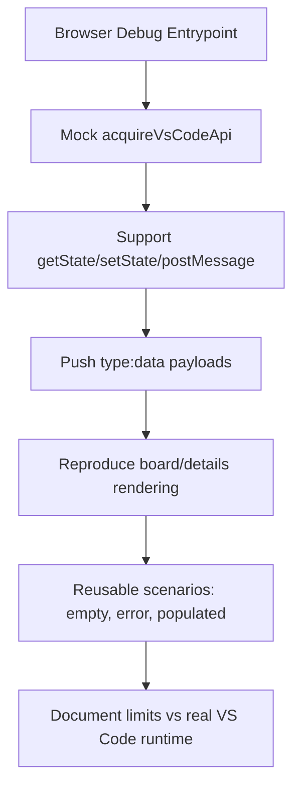

## req_008_web_debug_harness_for_cdx_logics_vscode_webview_rendering - Web Debug Harness for cdx-logics-vscode Webview Rendering
> From version: 1.9.1 (refreshed)
> Status: Done
> Understanding: 100% ((audit-aligned); refreshed)
> Confidence: 100% (governed)
> Complexity: Medium
> Theme: Front-End Debugging Workflow
> Reminder: Update status/understanding/confidence and references when you edit this doc.

# Needs
- Debug and iterate webview rendering in a browser/server without launching the VS Code extension host.
- Keep UI behavior close to production webview behavior by mocking the VS Code bridge API.
- Accelerate diagnosis of layout, filtering, details panels, and card state issues.

# Context
`media/main.js` depends on:
- `acquireVsCodeApi()` (`getState`, `setState`, `postMessage`),
- message-driven updates via `window.addEventListener("message", ...)` receiving `type: "data"` payloads.

Today, UI debugging requires VS Code runtime, which slows front-end iteration.

A local harness should serve the same assets and emulate extension messages to reproduce:
- empty/error/data-rich states,
- selection/details rendering,
- toolbar/filter behaviors.

# Acceptance criteria
- AC1: A browser-accessible debug entrypoint exists and renders the current webview UI assets.
- AC2: A compatible mock for `acquireVsCodeApi` is provided.
  - `getState`, `setState`, and `postMessage` are supported.
- AC3: The harness can push `type: "data"` payloads and reproduce board/details rendering deterministically.
- AC4: At least three reusable scenarios are available:
  - empty state,
  - error state,
  - populated state with multiple stages and references.
- AC5: Documentation states clear limits vs real VS Code runtime behavior (open/edit/read/promote side effects).

# Scope
- In:
  - Local debug shell/server.
  - VS Code API mock layer used by the current webview script.
  - Scenario injection tooling for message payloads.
  - Developer runbook for usage and constraints.
- Out:
  - Full emulation of VS Code-native commands and UI prompts.
  - Production packaging/distribution changes.

# Definition of Ready (DoR)
- [x] Problem statement is explicit and user impact is clear.
- [x] Scope boundaries (in/out) are explicit.
- [x] Acceptance criteria are testable.
- [x] Dependencies and known risks are listed.

# Backlog
- `logics/backlog/item_008_web_debug_harness_for_cdx_logics_vscode_webview_rendering.md`

# Companion docs
- Product brief(s): (none yet)
- Architecture decision(s): (none yet)
