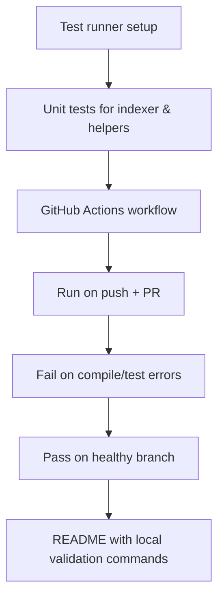

## req_009_add_automated_tests_and_github_ci_workflow_script - Add automated tests and GitHub CI workflow script
> From version: 1.9.1
> Status: Done
> Understanding: 100% ((audit-aligned); refreshed)
> Confidence: 100% (governed)
> Complexity: Medium
> Theme: Quality and CI
> Reminder: Update status/understanding/confidence and references when you edit this doc.

# Needs
- Add a reliable automated test layer for core extension behavior.
- Add a GitHub CI workflow script to run quality gates on each push/PR.
- Prevent regressions in indexing, references, and promotion behaviors by default.

# Context
The extension currently has no formal automated test suite and no CI workflow in the repository.

Without CI checks:
- regressions can ship silently;
- flow-manager integration changes are harder to validate;
- refactors in `src/logicsIndexer.ts` and `src/extension.ts` are higher risk.

The request focuses on a practical baseline:
- unit tests for indexer and critical helpers;
- repository-level GitHub workflow to run compile + tests consistently.

# Acceptance criteria
- AC1: A test runner setup exists and can be executed locally with a documented command.
- AC2: Initial test coverage includes critical Logics behavior:
  - stage/index parsing from markdown files;
  - reference extraction (`Derived from`, `Backlog`, `References`, `Used by`);
  - promotion eligibility guards (`canPromote`, request-used logic).
- AC3: A GitHub Actions workflow exists and runs on push + pull_request.
- AC4: CI workflow fails on compile/test failures and passes on healthy branch state.
- AC5: README (or equivalent docs) includes the minimal commands for local validation and CI scope.

# Scope
- In:
  - Test framework setup and baseline test files.
  - CI workflow file under `.github/workflows/`.
  - Minimal documentation updates for test/CI commands.
- Out:
  - Full E2E UI automation for webview rendering.
  - Advanced quality gates not required for initial baseline.

# Definition of Ready (DoR)
- [x] Problem statement is explicit and user impact is clear.
- [x] Scope boundaries (in/out) are explicit.
- [x] Acceptance criteria are testable.
- [x] Dependencies and known risks are listed.

# Backlog
- `logics/backlog/item_009_add_automated_tests_and_github_ci_workflow_script.md`

# Companion docs
- Product brief(s): (none yet)
- Architecture decision(s): (none yet)
