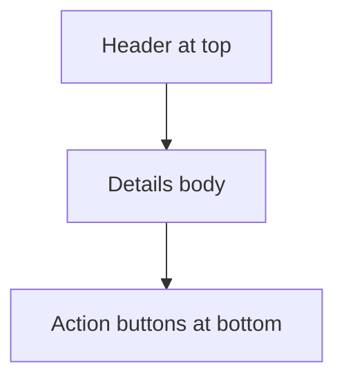

## req_011_horizontal_layout_keep_details_action_buttons_pinned_to_bottom_when_collapsed - Horizontal layout: keep details action buttons pinned to bottom when collapsed
> From version: 1.1.0 (refreshed)
> Status: Done
> Understanding: 100% (refreshed)
> Confidence: 100%
> Complexity: Medium
> Theme: UX Layout Consistency
> Reminder: Update status/understanding/confidence and references when you edit this doc.

# Needs
- In horizontal layout (non-stacked split), when Details is collapsed, action buttons must stay pinned at the bottom of the details panel.
- Preserve quick access to actions (`Promote`, `Edit`, `Read`) even with hidden details body.
- Avoid visual jump where actions move upward when panel collapses.

# Context
Current collapse behavior hides details body, but action button placement can feel unstable in horizontal layout.

Desired UX:
- collapsed details keeps a consistent panel scaffold;
- header remains at top, actions remain anchored at bottom;
- only details content body is collapsed.

# Acceptance criteria
- AC1: In horizontal layout, collapsing Details does not move action buttons away from panel bottom.
- AC2: Action buttons remain visible and clickable while details body is collapsed.
- AC3: Expanding Details restores normal body rendering without layout regressions.
- AC4: Stacked layout behavior is not regressed by this change.
- AC5: Keyboard and mouse interactions on action buttons remain unchanged.

# Scope
- In:
  - CSS/layout adjustments for collapsed details in horizontal split mode.
  - Validation of action-bar anchoring and interaction behavior.
- Out:
  - Redesign of button set or action semantics.
  - Rework of stacked layout split logic (covered by separate request).

# Definition of Ready (DoR)
- [x] Problem statement is explicit and user impact is clear.
- [x] Scope boundaries (in/out) are explicit.
- [x] Acceptance criteria are testable.
- [x] Dependencies and known risks are listed.

# Backlog
- `logics/backlog/item_011_horizontal_layout_keep_details_action_buttons_pinned_to_bottom_when_collapsed.md`

# Companion docs
- Product brief(s): (none yet)
- Architecture decision(s): (none yet)
