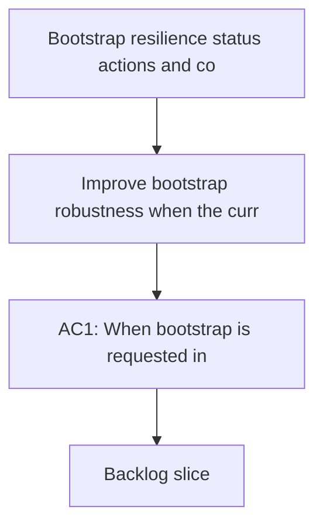

## req_014_bootstrap_resilience_status_actions_and_list_mode - Bootstrap resilience, status actions, and compact list mode
> From version: 1.3.0
> Status: Done
> Understanding: 100% (refreshed)
> Confidence: 99%
> Complexity: High
> Theme: UX and workflow resilience
> Reminder: Update status/understanding/confidence and references when you edit this doc.

# Needs
- Improve bootstrap robustness when the current project is not yet a git repository.
- Add missing Tools actions for bootstrap recovery and project About/GitHub navigation.
- Improve navigation productivity from the board/list by opening items on double-click.
- Add explicit status actions in details to mark a subject as `Done` or `Obsolete`.
- Avoid misleading root controls by disabling `Use Workspace Root` when already active.
- Add a compact list display mode as an alternative to current multi-column board mode.

# Context
Current orchestration UX has several friction points:
- Bootstrap proposal can fail when `git init` has not been executed.
- Bootstrap cannot be retriggered explicitly from Tools when skipped/canceled earlier.
- Opening docs is slower than necessary from visual cells/cards.
- Details panel lacks explicit lifecycle actions for items that are completed or intentionally abandoned.
- `Use Workspace Root` can be actionable while already selected, creating redundant/no-op interactions.
- Board-only display can become horizontally dense; users need a compact list alternative.

Desired direction:
- make bootstrap flow self-recovering and explicit;
- improve discoverability and direct actions in Tools and Details;
- support both Kanban-like board and compact list representations with a quick mode switch.

# Acceptance criteria
- AC1: When bootstrap is requested in a non-git project, the extension offers to run `git init` before retrying bootstrap.
- AC2: Tools menu exposes a dedicated action to run/re-run bootstrap (`Bootstrap Logics`) when Logics is not yet set up (or to retry after failure).
- AC3: Double-click on an item cell/card opens the corresponding file (same target behavior as `Open/Edit` action).
- AC4: Details panel exposes two explicit actions:
  - `Mark as done` updates item indicators/status consistently with existing completion logic.
  - `Mark as obsolete` marks item as intentionally not-to-be-treated while preserving it in docs.
- AC5: `Use Workspace Root` is disabled when the active root is already the workspace root.
- AC6: A new display-mode toggle button exists before `Refresh` and supports:
  - `Board mode`: current multi-column request/backlog/task/spec layout.
  - `List mode`: single-column compact view with horizontal separators between stages.
- AC7: Mode switch state persists in webview state and does not regress existing filters/details behaviors.
- AC8: Harness and VS Code runtime keep context-appropriate behavior (no regressions in existing commands and interactions).

# Scope
- In:
  - Bootstrap flow hardening (`git init` proposal path + Tools bootstrap action).
  - Board/list display mode switch and compact list rendering.
  - Double-click open behavior parity.
  - Details status actions (`Done`, `Obsolete`) and indicator updates.
  - Root control state logic for disabling `Use Workspace Root`.
  - Tests and docs updates for these UX/workflow additions.
- Out:
  - Full workflow redesign of board/details information architecture.
  - Historical migration of all existing docs to new status vocabulary beyond required updates.
  - Advanced multi-select or bulk-edit interactions.

# Definition of Ready (DoR)
- [x] Problem statement is explicit and user impact is clear.
- [x] Scope boundaries (in/out) are explicit.
- [x] Acceptance criteria are testable.
- [x] Dependencies and known risks are listed.

# Backlog
- `logics/backlog/item_014_bootstrap_resilience_status_actions_and_list_mode.md`

# Companion docs
- Product brief(s): (none yet)
- Architecture decision(s): (none yet)
