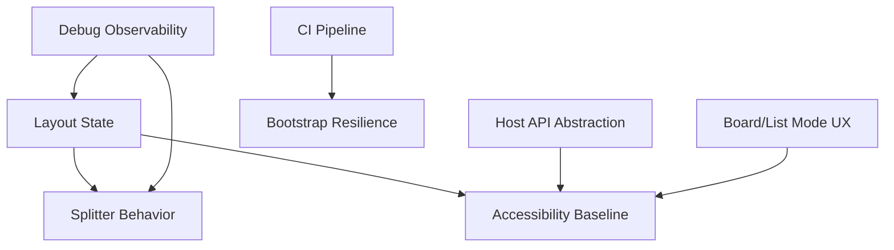

## req_016_reliability_hardening_layout_hostapi_a11y_ci_and_debug_observability - Reliability hardening for layout state, host API abstraction, accessibility, CI, and debug observability
> From version: 1.4.0 (refreshed)
> Status: Done
> Understanding: 100% (refreshed)
> Confidence: 100% (refreshed)
> Complexity: High
> Theme: Reliability and maintainability hardening
> Reminder: Update status/understanding/confidence and references when you edit this doc.

# Needs
- Stabilize layout/splitter behavior by using a single UI state source of truth.
- Isolate VS Code-specific calls behind a host adapter to keep web-debug mode functional.
- Expand regression tests on critical UI interactions and state transitions.
- Raise accessibility baseline for controls, tooltips, labels, and keyboard navigation.
- Harden CI with a strict pipeline that validates compile/test/lint/logics/package steps.
- Make bootstrap more resilient and explicitly recoverable from Tools.
- Improve board/list mode UX (state persistence, clear active mode, quick switch ergonomics).
- Add lightweight debug observability for UI state transitions to troubleshoot intermittent issues.

# Context
Recent work improved multiple flows but exposed recurring reliability gaps:
- intermittent splitter/layout desynchronization;
- mixed VS Code/web-debug behavior in some controls;
- insufficient automated coverage for high-risk UI transitions;
- accessibility inconsistencies across icon-only actions;
- CI protections that can be strengthened to catch integration issues earlier.

This request consolidates these improvements into one hardening track focused on stability, diagnosability, and long-term maintainability.

# Acceptance criteria
- AC1: Layout rendering is driven by explicit state (`layoutMode`, `detailsCollapsed`, related flags) with deterministic rules for splitter visibility/behavior.
- AC2: Splitter cannot remain visible or draggable in incompatible modes; drag state is reset on mode changes.
- AC3: Critical UI tests cover at least:
  - orientation switches (stacked/horizontal);
  - details collapse/expand;
  - splitter visibility + drag guards;
  - double-click open behavior;
  - done/obsolete actions;
  - `Use Workspace Root` disabled state.
- AC4: A `hostApi` abstraction (or equivalent) separates VS Code runtime calls from web-debug fallback behavior.
- AC5: In web-debug mode, unsupported VS Code calls are replaced by context-appropriate browser-native equivalents (or explicit no-op messaging) without breaking interactions.
- AC6: Accessibility baseline is enforced for interactive controls:
  - meaningful hover descriptions (`title`) for icon-only controls;
  - `aria-label`/roles where applicable;
  - keyboard accessibility and visible focus for actionable elements.
- AC7: CI workflow includes and enforces all required gates: compile, tests, lint, Logics docs lint, and extension packaging validation.
- AC8: Bootstrap flow is resilient when git is not initialized, and Tools exposes a reliable re-run action.
- AC9: Board/list mode UX includes persistent mode state and clear active-state feedback with no regressions in filters/details behavior.
- AC10: Debug logs for key state transitions are available behind a dedicated debug flag and remain silent by default.

# Scope
- In:
  - UI state hardening for layout/splitter/details.
  - Host adapter separation for VS Code and web-debug contexts.
  - Test suite expansion for critical regressions.
  - Accessibility uplift on existing controls.
  - CI strict workflow and validation script alignment.
  - Bootstrap recovery and board/list UX hardening.
  - Optional debug instrumentation guarded by flag.
- Out:
  - Full visual redesign of the webview.
  - New feature modules unrelated to reliability hardening.
  - Telemetry backend or remote logging infrastructure.

# Definition of Ready (DoR)
- [x] Problem statement is explicit and user impact is clear.
- [x] Scope boundaries (in/out) are explicit.
- [x] Acceptance criteria are testable.
- [x] Dependencies and known risks are listed.

# Backlog
- `logics/backlog/item_016_reliability_hardening_layout_hostapi_a11y_ci_and_debug_observability.md`

# Companion docs
- Product brief(s): (none yet)
- Architecture decision(s): (none yet)
