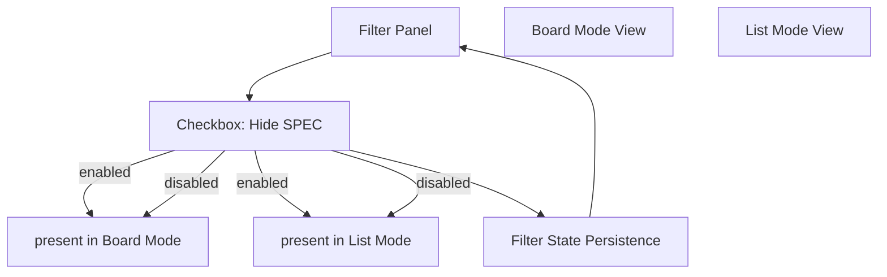

## req_017_filter_option_hide_spec_stage_by_default - Add filter option to hide SPEC stage by default
> From version: 1.5.0 (refreshed)
> Status: Done
> Understanding: 100% (refreshed)
> Confidence: 100% (refreshed)
> Complexity: Medium
> Theme: Filtering and view ergonomics
> Reminder: Update status/understanding/confidence and references when you edit this doc.

# Needs
- Add a filter option to completely hide `SPEC` in both board and list modes.
- Keep `SPEC` hidden by default to reduce visual noise for day-to-day orchestration.
- Preserve user control by allowing the `SPEC` stage to be re-enabled instantly from filters.

# Context
Current board and list modes always expose the `SPEC` stage, even when users focus on request/backlog/task flow only.
This creates avoidable density in both views and extra scanning cost.
The UI already has a filter panel and persisted filter state, so this change should extend that behavior with a dedicated `Hide SPEC` toggle.

# Acceptance criteria
- AC1: Filter panel includes a new checkbox option labeled `Hide SPEC`.
- AC2: `Hide SPEC` is enabled by default on initial load.
- AC3: In board mode, when `Hide SPEC` is enabled, the `SPEC` column is completely absent.
- AC4: In list mode, when `Hide SPEC` is enabled, the `SPEC` section is completely absent.
- AC5: Disabling `Hide SPEC` restores `SPEC` content in both board and list modes without breaking existing filters.
- AC6: Filter state persistence includes the new option and is restored on reload.

# Scope
- In:
  - Add UI toggle and state persistence for `Hide SPEC`.
  - Apply stage-level visibility filtering in board and list rendering paths.
  - Add regression tests for default-hidden behavior and toggle in both display modes.
- Out:
  - Changes to promotion semantics or stage model.
  - Redesign of existing toolbar/filter interaction patterns.

# Definition of Ready (DoR)
- [x] Problem statement is explicit and user impact is clear.
- [x] Scope boundaries (in/out) are explicit.
- [x] Acceptance criteria are testable.
- [x] Dependencies and known risks are listed.

# Backlog
- `logics/backlog/item_017_hide_spec_stage_by_default_filter_option.md`

# Companion docs
- Product brief(s): (none yet)
- Architecture decision(s): (none yet)
