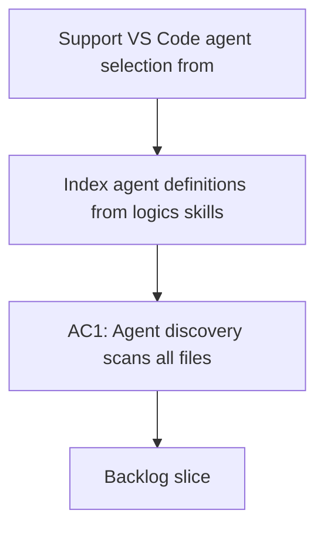

## req_018_support_vscode_agent_selection_from_skills_openai_yaml - Support VS Code agent selection from skills openai.yaml
> From version: 1.6.1
> Status: Done
> Understanding: 100% (refreshed)
> Confidence: 100% (refreshed)
> Complexity: Medium
> Theme: Agent orchestration and chat routing
> Reminder: Update status/understanding/confidence and references when you edit this doc.

# Needs
- Index agent definitions from `logics/skills/*/agents/openai.yaml`.
- Expose an agent Quick Pick using `display_name` and `short_description`.
- Inject selected `default_prompt` into the Codex chat input without auto-send.
- Preserve explicit `$logics-...` invocation override per message.
- Add YAML validation and a manual refresh command for agent registry reload.

# Context
The extension currently provides orchestration features around Logics documents, but agent discovery and selection from skill-level `openai.yaml` definitions is not surfaced as a dedicated UX flow.
The expected behavior is to select an active agent from extension commands, prefill the Codex chat input with agent context (`default_prompt`), and still allow explicit per-message override with `$logics-...`.
Agent files may evolve independently across skills, so schema validation and reload controls are required to keep behavior predictable without restarting the extension.
Current `openai.yaml` files expose `display_name`, `short_description`, and `default_prompt` under `interface`; they do not expose an explicit agent identifier field.

# Acceptance criteria
- AC1: Agent discovery scans all files matching `logics/skills/*/agents/openai.yaml`.
- AC2: Command `Logics: Select Agent` opens a Quick Pick listing agents with `display_name` (label) and `short_description` (description).
- AC3: Agent invocation ID is derived from the skill folder name (`logics/skills/logics-foo/...` -> `$logics-foo`) and surfaced in Quick Pick detail.
- AC4: Selecting an agent sets it as active and prefills Codex chat input with `default_prompt` without auto-sending a message.
- AC5: Prefill behavior is non-destructive:
  - if chat input is empty -> inject `default_prompt`;
  - if chat input is not empty -> prefix `default_prompt`, then one blank line, then existing user text.
- AC6: If chat input already contains `$logics-...`, selection does not overwrite invocation intent; explicit invocation remains authoritative for that message.
- AC7: If a chat message includes `$logics-...`, that explicit invocation takes priority over the active selected agent for that message only.
- AC8: YAML validation reports missing required fields, invalid types, and duplicate IDs.
- AC9: Command `Logics: Refresh Agents` rescans agent files and updates the registry without extension restart.
- AC10: Validation issues are visible in an Output Channel and a summary notification.

# Scope
- In:
  - Agent registry loader for `openai.yaml` files under skills.
  - Quick Pick command for selecting an active agent.
  - Codex chat prefill integration for selected agent `default_prompt`.
  - Per-message explicit override logic for `$logics-...`.
  - ID derivation strategy from skill folder names.
  - Non-destructive merge behavior for prefill when user already typed content.
  - Validation pipeline and refresh command wiring.
  - User-facing error reporting in output + summary toast.
- Out:
  - Redesign of existing orchestration board/webview.
  - Changes to non-OpenAI agent manifests.
  - Automatic message sending after prompt injection.

# Dependencies and risks
- Dependency: Stable field contract in `openai.yaml` (`display_name`, `short_description`, `default_prompt`) and deterministic folder naming for ID derivation.
- Dependency: Codex chat integration point supports programmatic input prefill.
- Risk: Duplicate or malformed YAML can silently degrade UX if not surfaced clearly.
- Risk: Codex chat command/API surface may change and break injection behavior.
- Risk: Registry freshness issues if file watcher and manual refresh behavior diverge.

# Definition of Ready (DoR)
- [x] Problem statement is explicit and user impact is clear.
- [x] Scope boundaries (in/out) are explicit.
- [x] Acceptance criteria are testable.
- [x] Dependencies and known risks are listed.

# Backlog
- `logics/backlog/item_018_support_vscode_agent_selection_from_skills_openai_yaml.md`

# Companion docs
- Product brief(s): (none yet)
- Architecture decision(s): (none yet)
