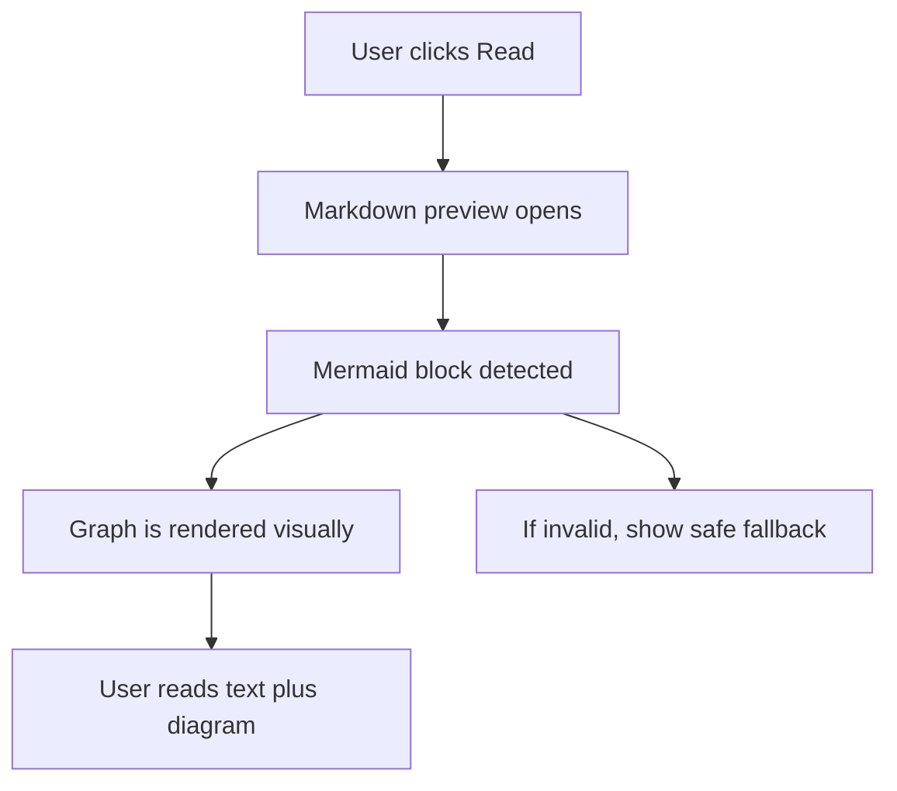

## req_019_render_mermaid_diagrams_in_read_markdown_view - Render Mermaid diagrams in Read markdown view
> From version: 1.7.0
> Status: Ready
> Understanding: 98%
> Confidence: 96%
> Complexity: Medium
> Theme: Markdown preview and Mermaid rendering
> Reminder: Update status/understanding/confidence and references when you edit this doc.

# Needs
- When a Logics document contains a fenced Mermaid block, the `Read` action should display the rendered graph, not only the raw code block.
- Keep the existing quick-review flow: user selects an item, clicks `Read`, and immediately sees the formatted markdown with the Mermaid diagram visible.
- Ensure Mermaid support works for the Logics documents now generated by the Flow Manager templates.
- Preserve a clear fallback when a Mermaid block is invalid or the preview runtime cannot render it.

# Context
The project already provides a `Read` action for Logics items.
In VS Code runtime, `Read` opens the markdown preview via `markdown.showPreview`. In browser harness mode, `Read` opens a preview tab built from the markdown content.
The Logics workflow now uses Mermaid diagrams in request/backlog/task documents by default, so the current preview experience is incomplete if the graph is not interpreted visually.
From a user perspective, clicking `Read` on a Logics document that includes:
- ```mermaid
  flowchart TD
      A[Need] --> B[Implementation]
  ```
should show the actual diagram in the rendered page.
This should improve readability for flow-oriented docs without degrading the existing markdown reading flow.



# Acceptance criteria
- AC1: If a selected Logics document contains a valid fenced Mermaid block, `Read` shows a rendered Mermaid diagram in the preview page.
- AC2: Standard markdown content remains rendered as before; Mermaid support does not regress normal headings, lists, links, or code fences.
- AC3: The behavior works for documents generated by current Flow Manager templates (`request`, `backlog`, `task`).
- AC4: If a Mermaid block is invalid or cannot be rendered, the preview fails gracefully:
  - the rest of the markdown remains readable;
  - the user receives a clear visible fallback or error indication instead of a broken blank view.
- AC5: The expected behavior is validated in the real `Read` flow used by the project, not only by opening the raw `.md` file directly.
- AC6: Browser-harness preview behavior is either aligned with VS Code preview rendering or explicitly documented when parity is not possible.

# Scope
- In:
  - `Read` experience for Logics markdown documents containing Mermaid blocks.
  - Rendering support for fenced ` ```mermaid ` code blocks in the project preview path.
  - Validation on representative request/backlog/task examples.
  - Error/fallback behavior for invalid Mermaid syntax.
- Out:
  - Editing Mermaid diagrams from inside the preview.
  - Rendering every possible markdown plugin or diagram syntax beyond Mermaid.
  - Broad redesign of the details panel or general editor UX.

# Dependencies and risks
- Dependency: The current `Read` flow relies on VS Code markdown preview in extension runtime and a custom/browser preview path in harness mode.
- Dependency: Mermaid rendering must be compatible with the preview runtime CSP and script-loading constraints.
- Risk: VS Code native markdown preview and harness preview may not support Mermaid the same way.
- Risk: Invalid Mermaid content could break part of the preview if error handling is not isolated.
- Risk: Adding Mermaid support could unintentionally affect existing markdown rendering performance or security constraints.

# Definition of Ready (DoR)
- [x] Problem statement is explicit and user impact is clear.
- [x] Scope boundaries (in/out) are explicit.
- [x] Acceptance criteria are testable.
- [x] Dependencies and known risks are listed.

# Backlog
- `logics/backlog/item_019_render_mermaid_diagrams_in_read_markdown_view.md`
