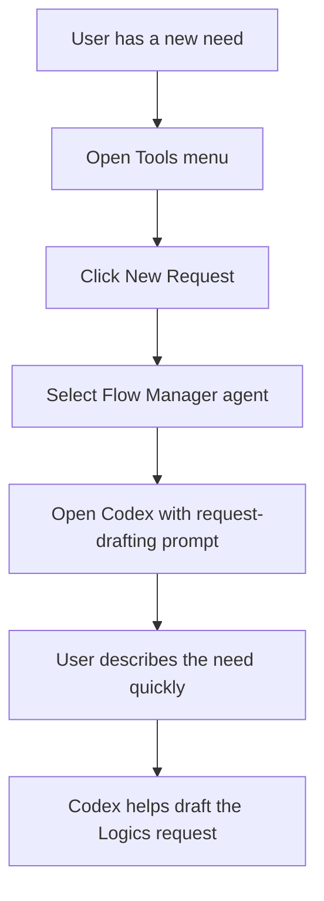

## req_020_add_tools_new_request_action_for_codex_prompt_bootstrap - Add Tools New Request action for Codex prompt bootstrap
> From version: 1.7.0
> Status: Done
> Understanding: 99%
> Confidence: 98%
> Complexity: Medium
> Theme: Agent orchestration and request drafting
> Reminder: Update status/understanding/confidence and references when you edit this doc.

# Needs
- Add a `New Request` action in the `Tools` menu, placed under `Select Agent`.
- This action should automatically select the correct agent for request drafting, then prepare a Codex prompt so the user can quickly describe the need in natural language.
- Keep the current fast-create flows intact for users who want to generate markdown files directly without going through Codex.
- Reduce the friction between “I have a new need” and “I can start drafting a proper Logics request with the right agent context”.

# Context
The extension already exposes:
- a `Select Agent` action in `Tools`;
- agent discovery from `logics/skills/*/agents/openai.yaml`;
- Codex prompt injection/copy-to-clipboard behavior;
- separate `New Request` creation flows that generate markdown docs directly.

Today, if a user wants help writing a new Logics request with Codex, they must manually:
- choose the right agent,
- open Codex,
- paste or reconstruct the prompt,
- then describe the need.

This is functional but still too manual for a frequent workflow.
For request authoring, the correct default agent is expected to be the Flow Manager-oriented agent (`$logics-flow-manager`), since it is responsible for the Logics request/backlog/task workflow.
The desired UX is:
- open `Tools`;
- click `New Request`;
- the extension sets the appropriate agent context;
- Codex opens with a prompt scaffold ready for the user to complete with the need/problem/request details.

This action should be clearly distinguished from the existing request-generation command, which creates a markdown request file directly from templates.

# Acceptance criteria
- AC1: The `Tools` menu exposes a visible `New Request` action placed under `Select Agent`.
- AC2: Triggering `Tools > New Request` selects or activates the request-drafting agent expected for this workflow (`$logics-flow-manager`, or an equivalent explicit request-authoring agent if the project introduces one later).
- AC3: Triggering `Tools > New Request` opens Codex and initializes a prompt scaffold dedicated to request drafting, without auto-sending the message.
- AC4: The scaffold is specific enough to accelerate drafting:
  - it indicates that the user wants to write a new Logics request;
  - it preserves the agent context;
  - it leaves an obvious place for the user to describe the need.
- AC5: The existing direct creation flows remain available and unchanged:
  - column/menu `New Request` still creates a markdown request file;
  - command palette `Logics: New Request` still creates a markdown request file.
- AC6: The user-facing labeling avoids ambiguity between:
  - “create a request file now”;
  - “start a Codex-guided request drafting flow”.
- AC7: If Codex prompt injection fails, the user gets a clear fallback (for example prompt copied to clipboard with an explanatory message).

# Scope
- In:
  - New `Tools` menu action for guided request drafting.
  - Agent selection/defaulting logic for request authoring.
  - Codex prompt bootstrap specific to writing a new Logics request.
  - Clear separation from the existing direct file-creation flow.
- Out:
  - Auto-generating the final markdown request file from the guided prompt flow in the same step.
  - Reworking all create-item actions across the whole UI.
  - General redesign of the Tools menu beyond adding and positioning this action.

# Dependencies and risks
- Dependency: the project keeps a stable agent capable of handling Logics request drafting, currently expected to be Flow Manager.
- Dependency: Codex integration points remain available for opening chat and prefilling or copying prompt content.
- Risk: the label `New Request` may be confused with the existing direct-create action if wording and placement are not explicit enough.
- Risk: agent-selection and prompt-bootstrap logic can diverge if the default request-authoring agent changes later.
- Risk: clipboard-based fallback can feel inconsistent if Codex direct injection is not available in the current runtime.

# Clarifications
- This request is about accelerating request drafting with Codex, not replacing the existing file creation command.
- The guided flow should help the user formulate the need first; converting that draft into a formal Logics markdown request can remain a separate step.

# Definition of Ready (DoR)
- [x] Problem statement is explicit and user impact is clear.
- [x] Scope boundaries (in/out) are explicit.
- [x] Acceptance criteria are testable.
- [x] Dependencies and known risks are listed.

# Backlog
- `logics/backlog/item_020_add_tools_new_request_action_for_codex_prompt_bootstrap.md`
