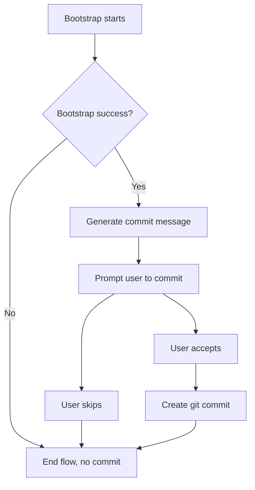

## req_021_propose_commit_after_bootstrap_with_generated_message - Propose commit after bootstrap with generated message
> From version: 1.7.0 (refreshed)
> Status: Done
> Understanding: 100% (refreshed)
> Confidence: 100% (refreshed)
> Complexity: Medium
> Theme: Bootstrap workflow and git ergonomics
> Reminder: Update status/understanding/confidence and references when you edit this doc.

# Needs
- At the end of project bootstrap, the assistant should propose creating a git commit for the generated changes.
- The assistant should generate the commit message itself so the user does not have to write one manually.
- The flow should keep bootstrap fast and ergonomic while helping users leave the repository in a clean, checkpointed state.
- The proposal should happen after bootstrap succeeds, not during partial or failed setup.

# Context
The current bootstrap flow already handles repository initialization and Logics setup:
- if the folder is not a git repository, the extension can propose `git init`;
- it adds the `logics/skills` submodule;
- it runs the bootstrap script;
- then it refreshes the extension state.

What is still missing is the final “project is now initialized, do you want to commit these bootstrap changes?” step.
In practice, bootstrap often produces a meaningful first repository delta:
- `.gitmodules` and submodule metadata;
- `logics/` structure and generated files;
- project scaffolding or workflow documentation depending on the bootstrapper behavior.

Without a commit proposal, users can leave bootstrap changes uncommitted, lose the clean initial checkpoint, or spend time crafting a message for a very standard action.
The desired UX is:
- bootstrap completes successfully;
- assistant proposes a commit;
- assistant pre-generates a sensible commit message;
- user can accept or skip the commit.

# Acceptance criteria
- AC1: After a successful bootstrap, the user is prompted with a commit proposal before the flow ends.
- AC2: The proposal includes an assistant-generated commit message appropriate for bootstrap-generated changes.
- AC3: The user can accept or skip the commit explicitly; skipping does not block bootstrap completion.
- AC4: No commit is proposed when bootstrap fails or exits early before producing a valid completed setup.
- AC5: The generated commit message is specific enough to describe bootstrap results and is not an empty/generic placeholder.
- AC6: The commit proposal behaves safely with git state:
  - it does not assume unrelated user changes should be included blindly;
  - it handles the case where there is nothing to commit.
- AC7: User-facing messaging makes it clear that this commit is about bootstrap/setup changes, not arbitrary project work.

# Scope
- In:
  - Post-bootstrap prompt proposing a commit.
  - Automatic generation of a bootstrap-appropriate commit message.
  - Safe handling of accept/skip/nothing-to-commit outcomes.
  - UX messaging around the end of bootstrap.
- Out:
  - Full AI-authored release notes or complex changelog generation.
  - Automatic push to remote after commit.
  - General-purpose commit assistant for every workflow in the extension.

# Dependencies and risks
- Dependency: bootstrap runs inside a git repository by the end of the flow, either pre-existing or initialized during bootstrap.
- Dependency: the extension can inspect repository status and create a commit non-interactively.
- Risk: the repository may already contain unrelated dirty changes before bootstrap starts.
- Risk: an over-generic commit message would reduce trust and usefulness.
- Risk: auto-staging the wrong files could surprise users if bootstrap scope is not constrained clearly.

# Clarifications
- This request is about proposing a commit at the end of bootstrap, not forcing one.
- The assistant-generated message can be deterministic/template-based if that is the safest implementation, as long as it is explicit and useful.
- The proposal should happen only once bootstrap has actually succeeded.

# Definition of Ready (DoR)
- [x] Problem statement is explicit and user impact is clear.
- [x] Scope boundaries (in/out) are explicit.
- [x] Acceptance criteria are testable.
- [x] Dependencies and known risks are listed.

# Backlog
- `logics/backlog/item_021_propose_commit_after_bootstrap_with_generated_message.md`

# Companion docs
- Product brief(s): (none yet)
- Architecture decision(s): (none yet)
