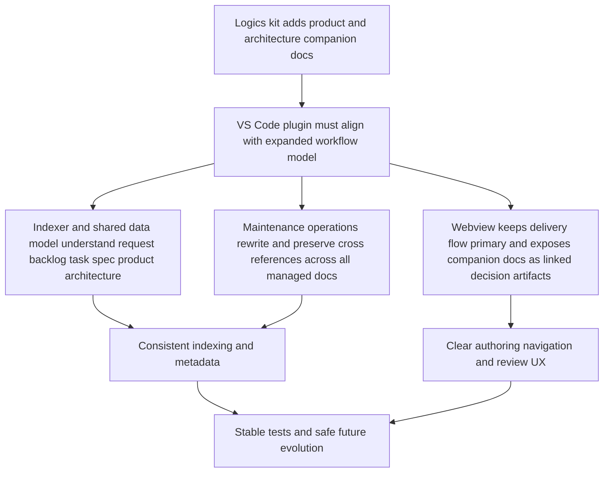

## req_022_align_vs_code_plugin_with_companion_docs_workflow - Align VS Code plugin with companion docs workflow
> From version: 1.8.1
> Status: Done
> Understanding: 99%
> Confidence: 99%
> Complexity: High
> Theme: VS Code orchestration, companion docs, and workflow coherence
> Reminder: Update status/understanding/confidence and references when you edit this doc.

# Needs
- Adapt the VS Code plugin so it fully supports the Logics companion-doc model introduced in the kit for `product` and `architecture`.
- Make `logics/product` and `logics/architecture` first-class citizens in the plugin data model, indexing, rendering, and maintenance flows.
- Keep the main delivery flow centered on `request`, `backlog`, and `task`, while exposing `product brief` and `ADR/DAT` documents as structured companion docs instead of orphan markdown files.
- Favor a UI model where companion docs are surfaced contextually from primary workflow items first, with optional secondary global visibility rather than default board parity with delivery stages.
- Preserve current request/backlog/task ergonomics and avoid regressions in promotion, rename, read, and fix flows.
- Add the missing UX affordances and test coverage so the plugin remains a reliable surface for the expanded Logics workflow.

# Context
The Logics kit now supports two new companion document families:
- `logics/product/prod_*.md` for product framing and major product decisions;
- `logics/architecture/adr_*.md` for architecture decisions and major technical direction.

The plugin in this repository is not yet aligned with that model.
Current gaps observed in the VS Code extension:
- the indexer only knows `request`, `backlog`, `task`, and `spec`;
- the webview board and filters are hardcoded to the same 4-stage model;
- rename/reference rewrite helpers only target legacy workflow folders;
- no dedicated UX exists to surface companion docs from request/backlog/task entries;
- tests do not yet lock the expected behavior for companion docs.

This creates a coherence problem:
- the kit can now generate and validate companion docs;
- the extension remains the primary workflow cockpit for the repository;
- users could create valid `prod_...` and `adr_...` docs that are invisible, weakly linked, or poorly maintained from the plugin.

The plugin should not simply add two more raw delivery columns and stop there.
The target architecture should keep:
- `request`, `backlog`, and `task` as the primary delivery flow;
- `spec` as a supporting artifact family, progressively closer to the companion/supporting-doc model than to the primary delivery flow;
- `product` and `architecture` as companion docs attached to primary workflow items and visible where they help decisions and execution.

The expected adaptation plan is:
- extend the plugin data model and indexing contract first;
- adapt maintenance helpers so rename/reference operations stay coherent across all managed docs;
- evolve the UI to surface companion docs intentionally, not as accidental extra clutter;
- enrich the details panel with a first-class `Companion docs` section before adding broad board-level visibility;
- expose a secondary visibility mode or filter for companion docs instead of making them default top-level delivery columns;
- define explicit control behavior for filters, buttons, and menus so companion docs integrate cleanly with existing hide/show mechanics and do not create ambiguous actions;
- then complete commands, affordances, and regression tests.

# Acceptance criteria
- AC1: The plugin indexer recognizes `logics/product/prod_*.md` and `logics/architecture/adr_*.md` as managed Logics documents with stable stage typing, metadata parsing, and reference extraction.
- AC2: Companion docs are visible in the plugin in a way that reflects their role:
  - primary flow items remain easy to scan;
  - `product` and `architecture` docs are discoverable from the UI without being reduced to invisible side files;
  - default board readability is not degraded by naive stage parity.
- AC3: The details panel of a request/backlog/task item can surface linked companion docs clearly enough to support navigation and review, through a dedicated `Companion docs` section or equivalent explicit affordance.
- AC4: Rename and reference-maintenance flows propagate safely across `request`, `backlog`, `task`, `spec`, `product`, and `architecture` managed docs.
- AC5: The plugin exposes an intentional creation/navigation path for companion docs:
  - preferably through a generic `Create companion doc` flow that lets the user choose `Product brief` or `Architecture decision`;
  - with room for fast contextual shortcuts if useful;
  - without ambiguity with primary delivery-item creation.
- AC6: Companion-doc controls are explicitly defined and consistent with current plugin ergonomics:
  - menus, buttons, and toggles expose companion-doc actions without overloading existing primary-flow actions;
  - default visibility and hide/show behavior are predictable;
  - labels distinguish delivery docs from companion/supporting docs.
- AC7: Existing workflows continue to work without regression:
  - request creation;
  - promotion request -> backlog -> task;
  - read preview including Mermaid;
  - doc fixing;
  - lifecycle actions;
  - agent-driven request drafting.
- AC8: Tests cover the extended workflow model at the appropriate levels:
  - indexer/unit coverage for `prod_` and `adr_`;
  - webview rendering or interaction coverage for the new visibility model;
  - maintenance/rename behavior where companion docs are involved.
- AC9: Tests also cover the control model for companion docs where relevant:
  - filter default state;
  - toggle behavior;
  - menu/button routing for creation and opening.
- AC10: The plugin architecture remains evolvable:
  - stage-specific assumptions are centralized rather than duplicated across indexer, extension host, and webview code;
  - adding future managed doc families should not require scattered ad hoc patches.
- AC11: If companion docs receive board-level visibility, that visibility is secondary and filterable rather than the default dominant information architecture.

# Scope
- In:
  - Shared plugin model updates for managed Logics document families.
  - Indexer and relation extraction updates for companion docs.
  - Webview/UI adaptation to expose companion docs coherently, starting from item details and contextual navigation.
  - Explicit definition and implementation of controls for companion-doc creation, opening, filtering, and visibility defaults.
  - Maintenance helper updates for rename/reference rewrite coverage.
  - Commands or actions needed to create/open companion docs intentionally.
  - Optional secondary visibility controls for companion/supporting docs if they preserve primary board readability.
  - Automated tests for the new workflow model.
- Out:
  - Redesign of the full plugin visual identity.
  - Reworking the Logics kit again from the plugin side.
  - Full new governance logic inside the plugin that duplicates kit-side lint/audit responsibilities.
  - Heavy automatic decision detection duplicated from the kit inside the extension.

# Dependencies and risks
- Dependency: the repository keeps `logics/skills` aligned with the companion-doc model already introduced in the submodule.
- Dependency: companion-doc conventions remain stable enough for the plugin to index them predictably (`prod_` and `adr_` prefixes, folder layout, indicator headers, and cross-reference sections).
- Dependency: the current plugin board/details architecture can absorb a richer document model without needing a full rewrite.
- Risk: treating `product` and `architecture` as naive extra columns could degrade scanability and make the board noisier instead of more useful.
- Risk: exposing too many creation entry points could confuse users if companion-doc actions and delivery-doc actions are not clearly separated.
- Risk: inconsistent default toggle states or poorly named controls could make companion docs feel hidden, duplicated, or unpredictable.
- Risk: stage logic is currently duplicated across TypeScript host code, webview JavaScript, and tests; partial updates could create inconsistent behavior.
- Risk: rename/reference rewrites could miss companion-doc paths if the managed-doc registry is not centralized first.
- Risk: adding actions without clear labels could blur the difference between delivery docs and companion docs.

# Clarifications
- This request is not asking for the plugin to replace kit-side decision logic; it must expose and support the workflow, not re-implement all governance rules.
- The preferred UI direction is to keep delivery items primary and present `product` / `architecture` as companion decision artifacts linked from them.
- The preferred creation UX is a generic `Create companion doc` entry point with a choice between `Product brief` and `Architecture decision`, optionally complemented by quicker contextual shortcuts.
- If board-level visibility for companion docs is added, it should be deliberate and filterable, not an uncontrolled extension of the existing 4-column model.
- The plugin may later help suggest companion docs, but V1 should prioritize explicit creation and visibility over strong automated detection.
- `spec` should remain supported, but the medium-term direction is to treat it as a supporting document family closer to companion docs than to the primary delivery flow.
- The preferred control model for V1 is:
  - keep the column add menu focused on primary delivery items;
  - add companion-doc creation primarily from the details panel and/or Tools menu;
  - keep companion-doc board visibility off by default unless explicitly enabled through a secondary filter or view mode;
  - preserve current hide/show controls and extend them only with deliberate supporting-doc visibility behavior.
- If new toggles are introduced, their default state and wording must be explicit enough that users understand whether companion/supporting docs are currently visible or hidden.
- A small internal plugin architecture refactor is acceptable if it reduces stage-specific duplication and stabilizes future evolution.

# Definition of Ready (DoR)
- [x] Problem statement is explicit and user impact is clear.
- [x] Scope boundaries (in/out) are explicit.
- [x] Acceptance criteria are testable.
- [x] Dependencies and known risks are listed.

# AC Traceability
- AC1 -> `item_023` and `task_021`. Proof: `src/logicsIndexer.ts` and `tests/logicsIndexer.test.ts` cover `product` / `architecture` managed-doc indexing.
- AC2 -> `item_025`, `item_026`, and `task_021`. Proof: `media/main.js` keeps `request` / `backlog` / `task` primary while exposing `product` / `architecture` contextually and secondarily.
- AC3 -> `item_025` and `task_021`. Proof: `media/main.js` details panel exposes a dedicated `Companion docs` section with linked navigation.
- AC4 -> `item_024` and `task_021`. Proof: `src/logicsDocMaintenance.ts`, `src/extension.ts`, and `tests/logicsDocMaintenance.test.ts` cover rename/reference maintenance across managed doc families.
- AC5 -> `item_027` and `task_021`. Proof: `package.json`, `src/extension.ts`, `media/main.js`, and `tests/webview.harness-a11y.test.ts` cover generic and contextual companion-doc creation flows.
- AC6 -> `item_026`, `item_027`, and `task_021`. Proof: `media/main.js` and `tests/webview.harness-a11y.test.ts` cover labels, toggles, button routing, and secondary visibility behavior.
- AC7 -> `item_027` and `task_021`. Proof: `npm run compile`, `npm run lint`, and `npm run test` pass after companion-doc support landed.
- AC8 -> `item_023`, `item_024`, `item_025`, `item_026`, `item_027`, and `task_021`. Proof: automated coverage spans indexer, maintenance, and webview layers.
- AC9 -> `item_026`, `item_027`, and `task_021`. Proof: `tests/webview.harness-a11y.test.ts` covers default filter state, toggle behavior, and creation/open routing.
- AC10 -> `item_023` and `task_021`. Proof: `src/logicsIndexer.ts` centralizes stage families, ordering, and managed-doc directories shared by host logic.
- AC11 -> `item_026` and `task_021`. Proof: companion docs remain hidden by default and are only surfaced through explicit secondary visibility controls.

# Companion docs
- Product brief(s): `logics/product/prod_000_companion_docs_ux_for_the_vs_code_plugin.md`
- Architecture decision(s): `logics/architecture/adr_000_represent_companion_docs_in_the_vs_code_plugin_workflow_model.md`

# Task
- `logics/tasks/task_021_align_vs_code_plugin_with_companion_docs_workflow.md`

# Backlog
- `logics/backlog/item_022_align_vs_code_plugin_with_companion_docs_workflow.md`
- `logics/backlog/item_023_align_plugin_indexer_and_managed_doc_model_for_companion_docs.md`
- `logics/backlog/item_024_extend_plugin_rename_and_reference_maintenance_to_companion_docs.md`
- `logics/backlog/item_025_add_companion_docs_section_and_navigation_in_plugin_details_panel.md`
- `logics/backlog/item_026_add_supporting_doc_visibility_controls_to_plugin_board_and_list_views.md`
- `logics/backlog/item_027_add_companion_doc_creation_flows_and_regression_coverage_in_plugin.md`

# Report
- Delivered:
  - managed-doc indexing and shared stage modeling for `product` and `architecture`;
  - rename/reference maintenance coverage across all managed-doc families;
  - contextual `Companion docs`, `Specs`, and `Primary flow` sections in plugin details;
  - secondary supporting-doc visibility controls and card badges in board/list views;
  - companion-doc creation from details, tools, and command palette with regression coverage.
- Validation:
  - `npm run compile`: OK
  - `npm run lint`: OK
  - `npm run test`: OK
  - `python3 logics/skills/logics-doc-linter/scripts/logics_lint.py`: OK
  - `npm run audit:logics`: plugin request/task changes are aligned, but the global audit still reports older historical Logics debt elsewhere in the repo.
