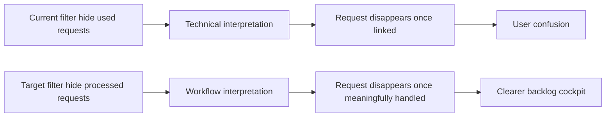

## req_023_replace_hide_used_requests_with_hide_processed_requests_semantics - Replace hide used requests with hide processed requests semantics
> From version: 1.9.0
> Status: Draft
> Understanding: 95%
> Confidence: 94%
> Complexity: Medium
> Theme: VS Code plugin filter semantics and workflow clarity
> Reminder: Update status/understanding/confidence and references when you edit this doc.

# Needs
- Replace the current plugin filter concept `Hide used requests` with a clearer user-facing concept closer to `Hide processed requests`.
- Stop exposing a purely technical notion of “used” when the actual expectation is closer to “already handled in the workflow”.
- Revisit the underlying rule so the filter hides requests that have already been treated meaningfully, not just requests that happen to have a structural link.
- Keep the change isolated from the current companion-doc implementation task so it can be implemented cleanly afterward.

# Context
The current plugin exposes a filter named `Hide used requests`.

This wording is too technical and does not match the mental model of the user.
Today, `used` mostly means:
- the request has a backlog reference;
- or the request is referenced by another managed doc.

That is not always equivalent to “already treated”.
A request can be:
- linked somewhere;
- partially framed;
- or structurally referenced;
without actually being processed in a meaningful delivery sense.

The expected UX is closer to:
- `Hide processed requests`;
- or, in French product intent, `Cacher les requests déjà traitées`.

This request is about both:
- the wording shown in the plugin;
- and the workflow rule behind that wording.

# Acceptance criteria
- AC1: The plugin no longer exposes the wording `Hide used requests` in the UI once this request is implemented.
- AC2: The replacement wording makes the intent understandable to a user who does not know the internal Logics data model.
- AC3: The filtering rule is explicitly redefined in code and tests through a dedicated notion such as `processed` or equivalent, instead of silently reusing the current `used` heuristic.
- AC4: The implementation distinguishes between:
  - a request that is merely referenced or linked;
  - and a request that has been meaningfully processed in the workflow.
- AC5: The chosen rule is documented well enough that future changes do not reintroduce ambiguity between `used` and `processed`.
- AC6: Existing request visibility behavior remains predictable and regression-tested in board/list views after the rename.

# Scope
- In:
  - Renaming the filter label in the plugin UI.
  - Revisiting the predicate behind that filter.
  - Updating relevant tests and helper naming.
  - Clarifying the semantics in code and, if needed, plugin-facing docs.
- Out:
  - Reworking all workflow completion semantics across the whole kit.
  - Redefining promotion rules globally.
  - Mixing this work into the current companion-doc implementation task.

# Dependencies and risks
- Dependency: the current plugin request/backlog/task model remains the main workflow context for deciding what “processed” means.
- Risk: reusing the old `used` predicate under a new label would improve wording but keep the wrong behavior.
- Risk: making `processed` too strict could leave too many already-handled requests visible.
- Risk: making `processed` too broad could hide requests prematurely and reduce board usefulness.

# Clarifications
- This request is intentionally separate from the current task in progress.
- The main point is not only to rename a toggle, but to align the filter semantics with actual workflow intent.
- A transitional implementation can start with a pragmatic rule, as long as that rule is clearly named and test-covered.
- The preferred direction is a user-facing concept equivalent to `already treated` rather than an internal concept equivalent to `already referenced`.

# Definition of Ready (DoR)
- [x] Problem statement is explicit and user impact is clear.
- [x] Scope boundaries (in/out) are explicit.
- [x] Acceptance criteria are testable.
- [x] Dependencies and known risks are listed.

# Backlog
- (none yet)
