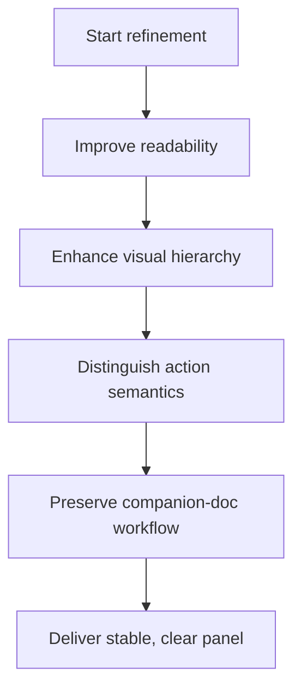

## req_024_refine_plugin_detail_panel_identity_and_action_hierarchy - Refine plugin detail panel identity and action hierarchy
> From version: 1.9.0 (refreshed)
> Status: Done
> Understanding: 100% (refreshed)
> Confidence: 100% (refreshed)
> Complexity: Medium
> Theme: VS Code plugin detail panel UX and action hierarchy
> Reminder: Update status/understanding/confidence and references when you edit this doc.

# Needs
- Refine the VS Code plugin detail panel so it remains readable and stable when titles or internal ids are long.
- Reduce the visual weight of low-value identity metadata when it competes with the actual subject of the selected Logics item.
- Improve the visual hierarchy of the bottom action bar so primary actions, secondary actions, and riskier actions are not presented with the same emphasis.
- Keep the current companion-doc sections and workflow affordances, but make the overall detail panel feel more intentional and easier to scan.

# Context
The recent companion-doc work made the detail panel significantly richer:
- contextual sections now exist for `Companion docs`, `Specs`, `References`, `Used by`, and `Primary flow`;
- the footer keeps core workflow actions pinned and accessible;
- supporting docs are now navigable and actionable from the panel.

That structure is solid, but some UX debt remains in the detail surface itself.
Observed issues:
- long titles and long ids can create visually heavy identity blocks at the top of the panel;
- the `Name` line often draws too much attention compared to the actual item title and workflow information;
- the current bottom buttons are easy to click, but they still read too much like a flat list of equally important actions;
- `Promote`, `Done`, `Obsolete`, `Edit`, and `Read` do not all have the same semantic weight, yet they are still visually very close;
- the current panel is functional, but the information hierarchy could be sharper.

This request is about UX refinement, not feature expansion.
It should preserve the current workflow behavior while improving:
- readability;
- hierarchy;
- action semantics;
- and resilience of the panel layout in edge cases.

# Acceptance criteria
- AC1: The detail panel title area remains stable and readable with long titles and long ids without degrading the overall panel layout.
- AC2: The identity block at the top of the detail panel gives priority to the item title over the internal id or filename-like value.
- AC3: The `Name` row and related metadata are visually present but less dominant than the main title and workflow sections.
- AC4: The footer action bar clearly distinguishes action hierarchy:
  - primary actions;
  - secondary actions;
  - and destructive or exceptional actions.
- AC5: `Obsolete` no longer has the same visual emphasis as safe/high-frequency actions if its semantics remain more sensitive.
- AC6: Disabled actions such as `Promote` when unavailable remain understandable without creating unnecessary visual noise.
- AC7: The detail panel keeps the current companion-doc and supporting-doc workflow affordances intact after the refinement.
- AC8: The preferred visual hierarchy is explicit in the implementation:
  - `Edit` and `Read` are primary actions;
  - `Promote` is visually strong only when available;
  - `Done` is secondary but still clearly actionable;
  - `Obsolete` is visually more cautious than primary actions.
- AC9: The main title can wrap and remain dominant, but should not expand uncontrolled forever; the preferred direction is to keep it within roughly two or three visible lines if technically feasible.
- AC10: The refinement is covered by automated tests where reasonable, especially for layout-related CSS or visible UI states that are currently locked by tests.

# Scope
- In:
  - Refining the title and metadata area of the detail panel.
  - Refining the presentation of the `Name` row and adjacent metadata.
  - Refining the hierarchy and emphasis of bottom action buttons.
  - Updating UI tests or CSS assertions to keep the behavior stable.
- Out:
  - Changing the underlying workflow semantics of `Promote`, `Done`, `Obsolete`, `Edit`, or `Read`.
  - Redesigning the whole extension visual language.
  - Reworking companion-doc logic again.
  - Implementing the separate `Hide processed requests` semantics request.

# Dependencies and risks
- Dependency: the current detail panel structure introduced by the companion-doc work remains the baseline.
- Dependency: pinned footer actions remain a valid interaction model for the plugin.
- Risk: over-correcting the identity block could hide useful technical information that power users still need.
- Risk: making the footer too subtle could reduce discoverability of important actions.
- Risk: purely cosmetic changes without a clear action hierarchy could improve aesthetics while leaving the workflow semantics ambiguous.
- Risk: layout tweaks for the detail panel can regress stacked/horizontal behavior if not verified carefully.

# Clarifications
- This request is about UX refinement, not about introducing new workflow capabilities.
- The goal is not to hide the internal id, but to stop it from competing visually with the title.
- The panel should remain delivery-oriented and operational, not become a decorative summary card.
- The footer should keep fast access to important actions, but with clearer hierarchy.
- If a button remains disabled, the visual treatment should help the user understand that it is currently inactive rather than making it look like a broken primary action.
- The preferred footer hierarchy is:
  - primary: `Edit`, `Read`
  - secondary/contextual: `Promote`, `Done`
  - sensitive/cautious: `Obsolete`
- `Promote` should only look primary when it is actually available.
- The `Name` row should stay visible, but as quieter technical metadata rather than as a second title.
- The preferred title treatment is:
  - the title remains the visual entry point;
  - the internal id remains available;
  - the title may wrap, but should stay reasonably bounded in height if possible.

# Definition of Ready (DoR)
- [x] Problem statement is explicit and user impact is clear.
- [x] Scope boundaries (in/out) are explicit.
- [x] Acceptance criteria are testable.
- [x] Dependencies and known risks are listed.

# Backlog
- `item_029_refine_plugin_detail_panel_identity_and_action_hierarchy`

- `logics/backlog/item_029_refine_plugin_detail_panel_identity_and_action_hierarchy.md`
# Companion docs
- Product brief(s): (none yet)
- Architecture decision(s): (none yet)
