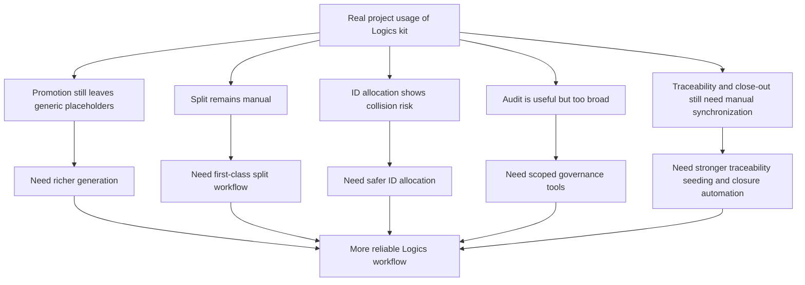

## req_025_harden_logics_kit_workflow_generation_and_governance_from_real_usage - Harden Logics kit workflow generation and governance from real usage
> From version: 1.9.1
> Status: Done
> Understanding: 100% (closed)
> Confidence: 100% (validated)
> Complexity: High
> Theme: Logics kit workflow quality, generation, and governance hardening
> Reminder: Update status/understanding/confidence and references when you edit this doc.

# Needs
- Improve the Logics kit so real workflow usage produces richer and safer docs by default, with less manual cleanup after promotion.
- Reduce the amount of generic placeholders left behind in generated backlog items and tasks.
- Add stronger workflow operations where current usage revealed friction: splitting, id allocation safety, scoped audit, AC traceability seeding, and close-out automation.
- Turn recent field feedback from the VS Code plugin project into concrete kit-level improvements rather than one-off manual workarounds.
- Keep the kit generic and stable enough for other repositories that consume the same `logics/skills` submodule.
- Make the kit more effective not only for end users of consuming projects, but also for the agent itself so repeated Logics workflows become faster, cleaner, and less manual.

# Context
Recent end-to-end usage of the Logics kit on the VS Code plugin project exposed a set of recurring pain points.

This kit is not local-only.
It lives in the shared `logics/skills` submodule and is reused across multiple projects.
That means every improvement must be evaluated with two simultaneous expectations:
- it should remain generic and safe for other repositories using the same kit;
- it should also reduce operational friction for the agent that relies on the kit repeatedly across those repositories.

The kit is structurally sound:
- request creation works;
- companion docs now exist for `product` and `architecture`;
- backlog/task promotion works;
- lint/audit/fixer tooling exists;
- closure and release workflows are improving.

But real usage still reveals several quality gaps in the authoring flow itself.

Observed issues:
- promotion from request to backlog and from backlog to task still generates docs that are valid but too generic, with placeholders such as `X.X.X`, `??%`, `Describe the problem...`, or empty scope/priority fields;
- acceptance criteria and clarifications already written in a request are not propagated enough into downstream docs;
- a realistic split still has to be done manually instead of being supported as a first-class workflow operation;
- id allocation already showed collision risk when docs are created close together or in parallel;
- the workflow audit is useful but too noisy when the repo contains older historical debt unrelated to the current scope;
- the kit audits AC traceability well, but does not seed that traceability strongly enough when docs are first promoted;
- finishing a task still requires too much manual status/report synchronization across request, backlog, and task docs;
- `Decision framing` surfaces useful signals, but still does too little operationally when the signal is `Consider`.

This request is not about changing the core Logics philosophy.
It is about making the existing workflow:
- richer by default;
- safer under real usage;
- easier to close cleanly;
- less dependent on manual cleanup after generation;
- more reusable across projects;
- and more effective as a day-to-day acceleration layer for the agent itself.

# Acceptance criteria
- AC1: Promotion from `request -> backlog` and `backlog -> task` propagates more useful source context by default, reducing placeholder-heavy generated docs.
- AC2: Promotion enrichment remains conservative and generic:
  - it reuses stable information already present in source docs such as `From version`, `Complexity`, `Theme`, AC ids, clarifications, and decision-framing signals;
  - it does not inject repo-specific assumptions or overly free-form generated summaries by default.
- AC3: Generated backlog items and tasks no longer remain superficially `Ready` while still carrying obvious unresolved placeholders such as `X.X.X`, `??%`, or template filler text.
- AC4: The kit exposes a first-class split capability, or an equivalent supported workflow, to turn a large request or umbrella item into multiple linked backlog items without manual renumbering and cross-link repair.
- AC5: ID allocation becomes robust enough that concurrent or near-concurrent creation does not produce collisions or duplicate numeric ids.
- AC6: The workflow audit supports a scoped mode focused on the current work perimeter, such as selected refs, paths, or an equivalent bounded target.
- AC7: AC traceability is seeded more helpfully during promotion so downstream docs start from a meaningful structure instead of an empty placeholder shell.
- AC8: Task close-out and finish workflows propagate status, DoD/report evidence, and linked request/backlog synchronization more automatically than they do today, without bluntly overwriting user-authored report content.
- AC9: `Decision framing` signals such as `Consider` lead to a more operational next step than a passive note alone.
- AC10: The resulting changes remain generic and compatible with the kit’s role as a shared submodule used by multiple projects rather than a repo-specific helper.
- AC11: The resulting changes measurably reduce repetitive manual cleanup for the agent when using the kit in normal request/backlog/task workflows.
- AC12: The resulting changes are covered by tests and documentation updates across the relevant kit skills and scripts.

# Scope
- In:
  - Hardening promotion output quality for backlog items and tasks.
  - Adding or formalizing split workflow support.
  - Hardening numeric id allocation.
  - Adding scoped audit capability.
  - Improving AC traceability seeding.
  - Improving close/finish synchronization and report propagation.
  - Strengthening placeholder detection and generation guardrails.
  - Making decision-framing signals more actionable.
- Out:
  - Rewriting the Logics kit from scratch.
  - Replacing the existing request/backlog/task model.
  - Replacing project-specific product or architecture docs with a different governance model.
  - Solving all historical audit debt already present in existing repos as part of this single request.
  - Forcing migration of all historical generated docs in one pass as part of this same delivery.

# Dependencies and risks
- Dependency: the current flow manager remains the main orchestration surface for generation and promotion.
- Dependency: existing Logics docs and tests remain stable enough to refactor generation incrementally rather than via a hard break.
- Dependency: the shared submodule contract must stay generic enough for repositories other than `cdx-logics-vscode`.
- Risk: enriching promotion too aggressively could create noisy downstream docs instead of cleaner ones.
- Risk: adding split support without clear link semantics could create umbrella/child docs that are more confusing than manual splitting.
- Risk: partial fixes to ID allocation could still fail under race conditions.
- Risk: a scoped audit mode could be misused to hide important issues if not clearly framed as a focused workflow aid rather than a global quality replacement.
- Risk: stronger close-out automation could overwrite user-written report sections if the update strategy is too blunt.
- Risk: solving only this repository’s symptoms could accidentally make the shared kit more opinionated and less reusable elsewhere.

# Clarifications
- This request comes from actual usage of the kit on a live project, not from speculative feature design.
- The goal is not more automation for its own sake; it is to reduce repetitive cleanup and increase workflow reliability.
- The preferred direction is to improve the existing commands and templates rather than introduce a parallel workflow system.
- A scoped audit mode should complement, not replace, the existing global audit.
- The kit must be treated as a shared product, not as a private helper for this repository alone.
- The preferred improvements are the ones that help both:
  - downstream project users;
  - and the agent itself when it relies on Logics repeatedly as an execution framework.
- A first implementation can prioritize the highest-value gaps:
  - richer promotion output;
  - split support;
  - safer id allocation;
  - scoped audit.
- Placeholder detection should become stricter where placeholders clearly indicate incomplete generated docs rather than intentional user content.
- The preferred execution model is to treat this request as an umbrella topic that will almost certainly split into several focused backlog items rather than one monolithic implementation item.
- Placeholder handling should start as a strong warning/lint path before becoming a hard blocking rule, to avoid breaking existing repositories too abruptly.
- The preferred split workflow is explicit, such as `split request` or `split backlog`, rather than an implicit side effect hidden inside another command.
- The preferred first split implementation is a CLI-driven workflow with explicit parameters and generated links, before any richer interactive UX is attempted.
- The preferred id-allocation solution is robust under concurrency, for example via a light locking mechanism or an equivalent atomic allocation strategy.
- For scoped audit, the preferred priority order is:
  - `--refs`
  - `--paths`
  - `--since-version`
- AC traceability seeding should pre-fill useful structure and AC ids, but should not invent “proof” statements automatically.
- Close/finish automation should be conservative:
  - update status, progress, DoD, validation, and linked workflow metadata;
  - avoid overwriting free-form report content when it already exists.
- `Decision framing` should become more actionable first through guidance, checklists, or suggested next steps before moving to fully automatic companion-doc generation.
- The preferred rollout is phased:
  - V1: richer promotion output, split support, safer id allocation, scoped audit;
  - V2: stronger AC traceability seeding, better close/finish automation, and more operational decision-framing follow-up.

# Definition of Ready (DoR)
- [x] Problem statement is explicit and user impact is clear.
- [x] Scope boundaries (in/out) are explicit.
- [x] Acceptance criteria are testable.
- [x] Dependencies and known risks are listed.

# Companion docs
- `adr_001_keep_logics_kit_hardening_incremental_generic_and_agent_productive`

# Backlog
- `item_030_harden_logics_kit_workflow_generation_and_governance_from_real_usage`

# Task
- `task_024_harden_logics_kit_workflow_generation_and_governance_from_real_usage`
