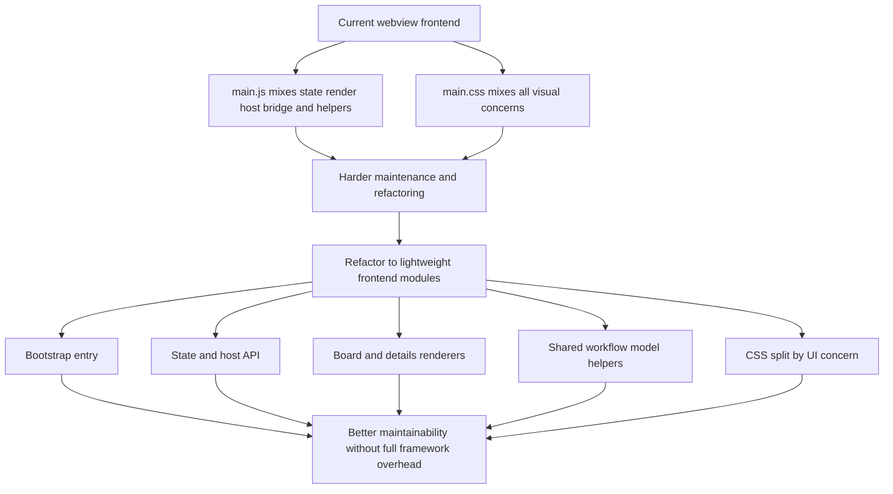

## req_026_refactor_webview_frontend_structure_without_introducing_a_full_framework - Refactor webview frontend structure without introducing a full framework
> From version: 1.9.1
> Status: Done
> Understanding: 100% (closed)
> Confidence: 99% (validated)
> Complexity: High
> Theme: VS Code webview frontend architecture and maintainability
> Reminder: Update status/understanding/confidence and references when you edit this doc.

# Needs
- Refactor the plugin webview frontend so it is easier to maintain and evolve than the current single-file `main.js` and `main.css` structure.
- Reduce the current concentration of rendering, state handling, host communication, workflow helpers, and styling in two growing files.
- Keep the webview intentionally lightweight and avoid introducing a full frontend framework unless a future need genuinely justifies it.
- Improve maintainability without regressing packaging simplicity, CSP safety, debug ergonomics, or test stability.

# Context
The current plugin webview works and is already well covered by tests, but its frontend structure has grown incrementally.

Today:
- [`media/main.js`]( /Users/alexandreagostini/Documents/cdx-logics-vscode/media/main.js) mixes state, rendering, host API calls, workflow helpers, markdown preview helpers, and UI interactions;
- [`media/main.css`]( /Users/alexandreagostini/Documents/cdx-logics-vscode/media/main.css) mixes layout, toolbar, board, cards, detail panel, preview, and responsive rules;
- the current shape was pragmatic when the webview was smaller, but it is becoming a scaling constraint.

The right response is not necessarily to jump to React, Vite, or a heavy frontend toolchain.
For this plugin, the preferred direction is more conservative:
- keep a vanilla webview;
- split responsibilities into explicit modules;
- preserve a simple loading model;
- and reduce architectural coupling inside the existing frontend.

The intended architecture direction is:
- `main.js` becomes a thin bootstrap entry point;
- host communication, state, rendering, and workflow-model helpers move into dedicated modules;
- CSS is split by UI concern rather than accumulated indefinitely in one file;
- shared workflow logic is centralized instead of duplicated inside rendering code.

# Acceptance criteria
- AC1: The webview frontend is split into clearer modules with explicit responsibilities instead of concentrating most logic in a single `main.js` file.
- AC2: Shared workflow/model helpers are centralized so board and detail rendering do not keep duplicating stage-specific logic.
- AC3: Host communication is isolated behind a clearer frontend bridge layer instead of being spread across mixed rendering logic.
- AC4: The detail panel and board/list rendering logic become easier to reason about through separate rendering units or equivalent structure.
- AC5: CSS is decomposed by UI concern, or at least reorganized in a way that significantly reduces the current all-in-one stylesheet coupling.
- AC6: The refactor preserves a lightweight webview architecture and does not introduce a full frontend framework unless explicitly revisited in a later request.
- AC7: Packaging, CSP compatibility, extension loading, and current webview behavior remain stable after the refactor.
- AC8: Existing automated tests continue to pass, and new tests are added where the refactor introduces meaningful new module boundaries or contracts.
- AC9: The resulting structure remains understandable to a future contributor who expects a pragmatic VS Code webview architecture rather than a full SPA stack.

# Scope
- In:
  - Frontend module decomposition for the webview.
  - Separation of state, host bridge, rendering, and workflow-model helpers.
  - CSS reorganization by concern.
  - Minimal bootstrap changes needed to wire the new structure.
  - Test updates required by the refactor.
- Out:
  - A full migration to React, Vue, Svelte, or another framework.
  - A full redesign of the plugin visual identity.
  - Rewriting extension-host logic that does not need to move.
  - Changing the plugin workflow model as part of the refactor.

# Dependencies and risks
- Dependency: the current webview behavior and tests provide a stable baseline to protect during refactor.
- Dependency: the plugin can keep serving static webview assets without requiring a large new build pipeline.
- Risk: splitting files without clear boundaries could simply turn one large file into several poorly defined files.
- Risk: introducing too much tooling for the webview could increase maintenance cost more than it helps.
- Risk: moving workflow helpers incorrectly could duplicate logic between frontend and extension host instead of clarifying it.
- Risk: CSS decomposition can create ordering regressions if the layering strategy is not explicit.

# Clarifications
- This request is about structure and maintainability, not about adding new user-facing workflow features.
- The preferred direction is a progressive refactor, not a “rewrite the frontend” move.
- The current recommendation is to stay with vanilla JS/CSS for the webview and improve modularity before considering a full framework.
- The preferred extraction order is:
  - shared workflow/model helpers
  - host API bridge
  - detail renderer
  - board/list renderer
  - CSS decomposition
- `main.js` should remain as the bootstrap entry point once the refactor is complete.
- The resulting architecture should make future detail-panel, board, and companion-doc changes easier to implement with lower regression risk.

# Definition of Ready (DoR)
- [x] Problem statement is explicit and user impact is clear.
- [x] Scope boundaries (in/out) are explicit.
- [x] Acceptance criteria are testable.
- [x] Dependencies and known risks are listed.

# Companion docs
- `adr_002_keep_the_plugin_webview_as_a_modular_vanilla_frontend`

# Task
- `task_026_refactor_webview_frontend_structure_without_introducing_a_full_framework`

# Backlog
- `item_032_refactor_webview_frontend_structure_without_introducing_a_full_framework`
