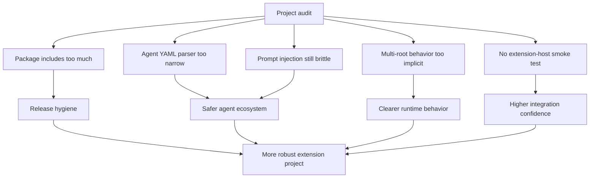

## req_027_harden_extension_packaging_agent_loading_and_workspace_runtime_behavior - Harden extension packaging, agent loading, and workspace runtime behavior
> From version: 1.9.1
> Status: Done
> Understanding: 100% (closed)
> Confidence: 99% (validated)
> Complexity: High
> Theme: Extension runtime robustness, packaging hygiene, and integration safety
> Reminder: Update status/understanding/confidence and references when you edit this doc.

# Needs
- Harden the main VS Code extension project in the areas that surfaced during the project audit: packaging hygiene, agent definition loading, chat prompt injection robustness, multi-root workspace behavior, and integration-level safety checks.
- Reduce avoidable release noise by ensuring the VSIX package contains only the files that should actually ship.
- Make agent loading and prompt injection more resilient so the extension remains reliable as the Logics ecosystem grows.
- Improve runtime clarity in real workspaces, especially when users work with multiple folders or less predictable VS Code environments.

# Context
The project is in a strong state functionally:
- TypeScript compile passes;
- webview and host-side unit coverage are solid;
- packaging works;
- the Logics workflow surface is now substantially richer than before.

But a targeted audit of the project still revealed several structural improvement areas in the main extension repository itself:
- the published VSIX currently includes development-oriented material such as tests, debug files, and repository metadata because packaging boundaries are still too broad;
- the agent registry parser is intentionally lightweight, but too narrow to safely support richer YAML definitions such as multiline prompts or more expressive values;
- Codex/chat prompt injection still relies on clipboard manipulation and generic command timing that can be brittle in real editor contexts;
- multi-root workspace behavior is effectively first-folder-only unless the user manually overrides the project root;
- current tests are strong at the unit and jsdom harness level, but there is still no real extension-host smoke test that proves the extension boots and registers correctly in an actual VS Code integration context.

These issues are not all equally urgent, but together they affect:
- release quality;
- runtime robustness;
- future extensibility;
- and confidence that the extension behaves well outside the most common local path.

This request is not about the shared Logics kit itself.
It is about hardening the main extension project around the parts that are already working but still structurally fragile.

Related but separate topics already exist:
- `req_025` for shared-kit workflow hardening;
- `req_026` for refactoring the webview frontend structure.

# Acceptance criteria
- AC1: The packaged VSIX excludes development-only files that should not ship with the extension, while preserving all files required at runtime.
- AC2: Packaging boundaries are explicit and maintainable, for example through a `files` whitelist or an equivalent packaging rule set.
- AC3: Agent definition loading becomes robust enough to safely support richer valid YAML content, including multiline prompt bodies and normal YAML comments, while keeping the accepted schema explicit and test-covered.
- AC4: Prompt injection into Codex/chat workflows becomes more defensive and predictable, with a clearer and earlier fallback path when the environment does not support the preferred behavior reliably.
- AC5: Prompt-injection hardening minimizes clipboard interference and avoids relying on temporary clipboard replacement as the primary control path when a safer fallback is available.
- AC6: Multi-root workspace behavior becomes clearer and safer than the current implicit “first workspace folder wins” approach, with an explicit root-selection model when needed.
- AC7: The extension gains at least one meaningful integration-level smoke check beyond the current unit/jsdom coverage, focused on package-and-activate or an equivalent activation-readiness path.
- AC8: The improvements remain scoped to the main extension project and do not duplicate the shared-kit hardening work already tracked separately.
- AC9: The resulting changes are covered by tests and documentation or release-process notes where needed.

# Scope
- In:
  - VSIX packaging hygiene.
  - Agent registry parsing and validation hardening.
  - Prompt-injection resilience and fallback behavior.
  - Workspace-root behavior improvements for multi-root contexts.
  - Extension-level smoke/integration validation improvements.
- Out:
  - Shared-kit workflow hardening already covered by `req_025`.
  - Webview module refactor already covered by `req_026`.
  - Redesigning the whole extension UI.
  - Replacing the current Logics workflow model.

# Dependencies and risks
- Dependency: current unit and harness tests remain the baseline safety net while integration coverage is added.
- Dependency: packaging changes must preserve runtime assets such as `media/`, compiled `out/`, and required dependencies.
- Risk: packaging cleanup can accidentally exclude assets needed by the extension at runtime if the packaging contract is not explicit enough.
- Risk: switching to a more capable YAML parser without clear validation rules can broaden accepted input while reducing predictability.
- Risk: prompt-injection changes can regress current productive paths if fallback logic is not carefully staged.
- Risk: improving multi-root behavior can create more prompts or configuration complexity if the UX is too heavy-handed.

# Clarifications
- This request is about project-level hardening of the extension, not about the shared `logics/skills` submodule.
- The preferred packaging direction is strict and explicit:
  - ship only the files the extension needs at runtime;
  - avoid shipping tests, debug material, or repository metadata by default.
- The preferred agent-loading direction is to support real YAML safely rather than depend on a fragile pseudo-parser.
- The preferred schema should remain simple and explicit, for example around fields such as:
  - `display_name`
  - `short_description`
  - `default_prompt`
- Prompt bodies should support realistic multiline content without requiring a custom ad hoc format.
- The preferred prompt-injection direction is to keep productive automation where it is reliable, but degrade earlier to a safer fallback when uncertainty is high.
- Preserving the user clipboard should be treated as a design constraint rather than an incidental side effect.
- The preferred workspace direction is to reduce ambiguity in multi-root setups rather than silently assume the first folder is always the right root.
- The preferred multi-root model is:
  - one active project root at a time;
  - explicit root selection when several workspace folders are open;
  - remembered choice where appropriate instead of repeated silent guessing.
- The preferred testing direction is to add a lightweight integration smoke path, not to replace the existing fast unit and webview harness tests.
- The preferred first smoke check is pragmatic:
  - package the extension;
  - activate it in an extension-host context;
  - verify that core activation or command registration succeeds.

# Definition of Ready (DoR)
- [x] Problem statement is explicit and user impact is clear.
- [x] Scope boundaries (in/out) are explicit.
- [x] Acceptance criteria are testable.
- [x] Dependencies and known risks are listed.

# Companion docs
- `adr_003_harden_extension_runtime_with_explicit_packaging_and_workspace_selection`

# Task
- `task_025_harden_extension_packaging_agent_loading_and_workspace_runtime_behavior`

# Backlog
- `item_031_harden_extension_packaging_agent_loading_and_workspace_runtime_behavior`
