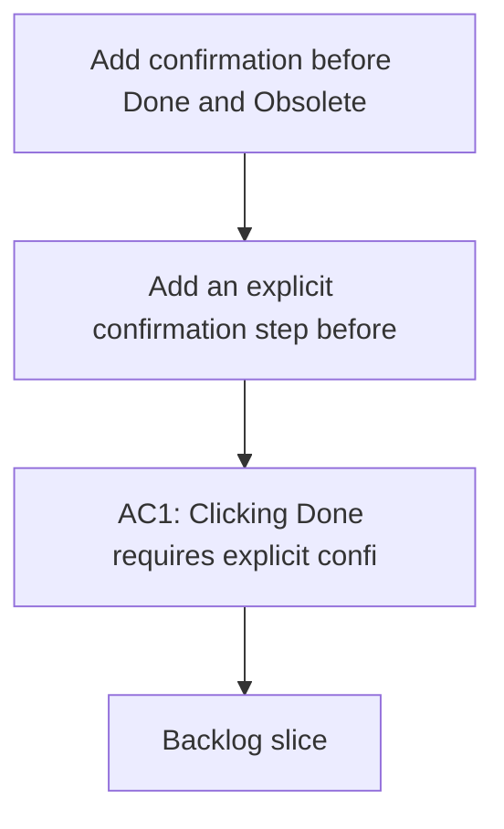

## req_030_add_confirmation_for_done_and_obsolete_actions - Add confirmation before Done and Obsolete lifecycle actions
> From version: 1.9.2
> Status: Done
> Understanding: 100% (refreshed)
> Confidence: 100% (refreshed)
> Complexity: Low
> Theme: Lifecycle safety and action confirmation
> Reminder: Update status/understanding/confidence and references when you edit this doc.

# Needs
- Add an explicit confirmation step before applying `Done`.
- Add an explicit confirmation step before applying `Obsolete`.
- Reduce accidental lifecycle changes from single-click actions in the detail panel.

# Context
The detail panel currently exposes `Done` and `Obsolete` as direct action buttons.
Those actions are useful and fast, but they currently execute immediately on click.

That behavior is risky because both actions change persisted item metadata:
- `Done` marks the item as complete;
- `Obsolete` marks it as intentionally not to be treated.

There is already informational feedback after the action completes, but there is no confirmation before the write happens.
In a narrow operational UI, especially with buttons close to other frequent actions, a one-click irreversible-style change is too easy to trigger accidentally.

This request is about adding a guardrail, not slowing down the workflow unnecessarily.
The goal is:
- confirm intent before applying the lifecycle change;
- keep the action understandable;
- preserve the existing success feedback after the change.

# Acceptance criteria
- AC1: Clicking `Done` requires explicit confirmation before the lifecycle update is written.
- AC2: Clicking `Obsolete` requires explicit confirmation before the lifecycle update is written.
- AC3: Cancelling the confirmation leaves the item unchanged.
- AC4: Confirming the action preserves the current write behavior and follow-up refresh behavior.
- AC5: The confirmation message clearly identifies both the target item and the action being confirmed.
- AC6: `Obsolete` confirmation should read with more caution than `Done`, reflecting the more sensitive semantics.
- AC7: Existing post-action information feedback remains available after a confirmed update.
- AC8: Tests cover both the confirmed path and the cancelled path for lifecycle actions where practical.

# Scope
- In:
  - Add confirmation flow for `Done`.
  - Add confirmation flow for `Obsolete`.
  - Preserve existing lifecycle update logic after confirmation.
  - Add regression coverage for confirm/cancel behavior.
- Out:
  - Redesigning the detail panel action bar.
  - Changing the meaning of `Done` or `Obsolete`.
  - Adding confirmation to unrelated actions like `Edit`, `Read`, or `Promote`.

# Dependencies and risks
- Dependency: existing lifecycle update path remains the source of truth after confirmation.
- Dependency: the webview-to-extension command flow should stay simple and understandable.
- Risk: over-generic confirmation wording could make the action feel vague and reduce user trust.
- Risk: if both actions share the exact same tone, `Obsolete` may not feel appropriately cautious.
- Risk: missing cancel-path coverage could let accidental writes slip through despite the new UX.

# Clarifications
- This request is about confirmation before mutation, not about replacing the current information message after mutation.
- `Done` and `Obsolete` can use the same technical confirmation mechanism, but their copy should reflect their different semantics.
- The preferred confirmation should be explicit enough to prevent accidental clicks, while still remaining lightweight.
- The target item id or title should appear in the confirmation message so the user knows exactly what will be changed.
- The recommended UX is a simple confirmation for `Done`, and a more cautious, more explicit confirmation for `Obsolete`.

# Definition of Ready (DoR)
- [x] Problem statement is explicit and user impact is clear.
- [x] Scope boundaries (in/out) are explicit.
- [x] Acceptance criteria are testable.
- [x] Dependencies and known risks are listed.

# Backlog
- `logics/backlog/item_035_add_confirmation_for_done_and_obsolete_actions.md`

# Companion docs
- Product brief(s): (none yet)
- Architecture decision(s): (none yet)
