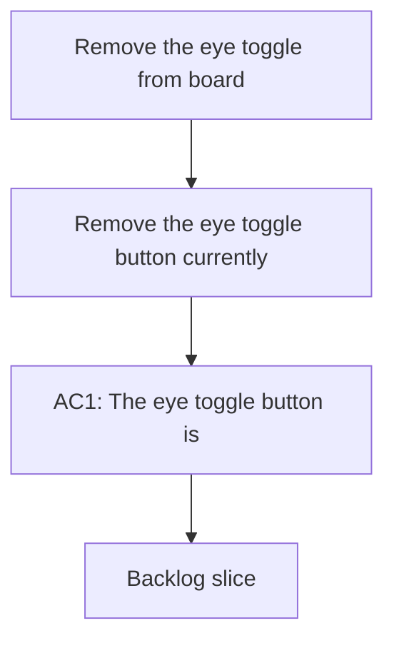

## req_031_remove_column_eye_toggle_from_board - Remove the eye toggle from board columns
> From version: 1.9.3
> Status: Done
> Understanding: 100% (refreshed)
> Confidence: 100% (refreshed)
> Complexity: Low
> Theme: Board UI simplification and control hygiene
> Reminder: Update status/understanding/confidence and references when you edit this doc.

# Needs
- Remove the eye toggle button currently shown in board column headers.
- Simplify the column header actions so the board exposes only controls that still earn their place.
- Reduce visual noise and avoid suggesting a per-column hide/show interaction if that interaction is no longer desirable.

# Context
The board column headers currently include an eye-style toggle used to hide or show individual columns.
That control adds visual weight to every column header and increases scanning noise in an already dense orchestration surface.

The current product direction is to remove that affordance entirely.
This is not a restyling request.
It is a behavior and UI-surface reduction request:
- the eye button should disappear;
- the related hide/show interaction should no longer be presented as part of the board UX.

This change should make the board feel lighter and more intentional.
It should also avoid confusion with other visibility mechanisms that already exist through filters and responsive layout behavior.

# Acceptance criteria
- AC1: The eye toggle button is no longer rendered in board column headers.
- AC2: The board no longer exposes the per-column hide/show interaction previously triggered by that control.
- AC3: Removing the eye toggle does not break the remaining header actions, including add actions where still applicable.
- AC4: Column headers remain aligned and visually stable after the control is removed.
- AC5: Existing board rendering continues to work in both normal and responsive layouts after the control is removed.
- AC6: Any persisted state that only existed to support the removed eye-toggle behavior is either safely ignored or cleaned up without regressions.
- AC7: Webview tests are updated so the removed control and its old interaction path do not regress back in later.

# Scope
- In:
  - Remove the eye toggle from board column headers.
  - Remove or neutralize the corresponding board-column hide/show interaction.
  - Update relevant tests and UI expectations.
  - Keep the rest of the board header behavior intact.
- Out:
  - Redesigning the whole board header layout.
  - Changing filter semantics.
  - Changing responsive split/list behavior.
  - Reworking unrelated detail-panel collapse interactions.

# Dependencies and risks
- Dependency: current board header rendering remains the source of truth for column actions.
- Dependency: any persisted collapsed-stage state needs to be handled safely after the control disappears.
- Risk: removing the UI control without cleaning up the old behavior path can leave dead state or hidden assumptions in rendering logic.
- Risk: header spacing can look off after removing the button if alignment rules were built around its presence.
- Risk: tests may still encode the previous column-toggle behavior and need explicit cleanup.

# Clarifications
- The request is to remove the eye button, not just hide it visually while keeping the feature active in the background.
- The preferred result is a simpler board header with fewer controls, not a relocated eye toggle.
- If the add button remains on some columns, it should keep a clean alignment without the former eye-toggle pairing.
- Existing global visibility mechanisms such as filters are separate and should not be affected by this request.

# Definition of Ready (DoR)
- [x] Problem statement is explicit and user impact is clear.
- [x] Scope boundaries (in/out) are explicit.
- [x] Acceptance criteria are testable.
- [x] Dependencies and known risks are listed.

# Backlog
- `logics/backlog/item_036_remove_column_eye_toggle_from_board.md`

# Companion docs
- Product brief(s): (none yet)
- Architecture decision(s): (none yet)
