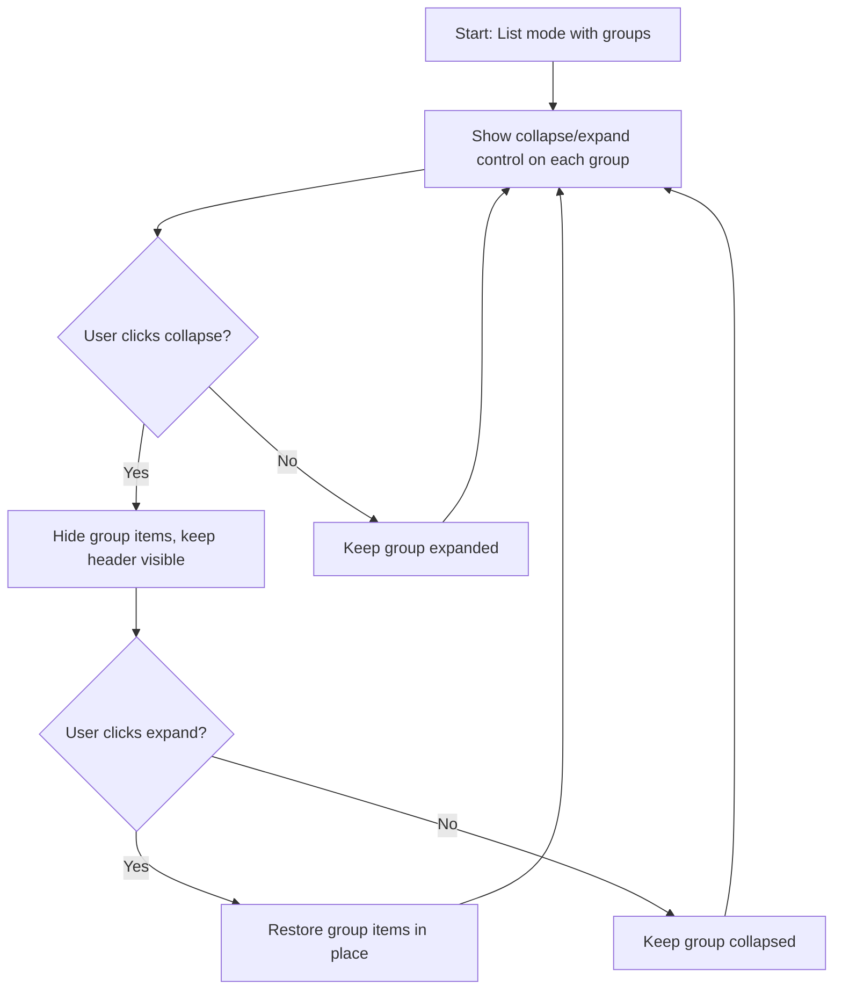

## req_033_allow_collapsing_and_expanding_groups_in_list_mode - Allow collapsing and expanding groups in list mode
> From version: 1.9.3 (refreshed)
> Status: Done
> Understanding: 100% (refreshed)
> Confidence: 100% (refreshed)
> Complexity: Medium
> Theme: List-mode navigation and density control
> Reminder: Update status/understanding/confidence and references when you edit this doc.

# Needs
- Allow each group/section in list mode to be collapsed and expanded.
- Reduce vertical density when many groups are present in list mode.
- Give users a way to focus on the groups they care about without leaving list mode.

# Context
List mode is useful when board mode becomes too wide or too dense, but once several groups are populated it can become vertically heavy.
Users may want to keep list mode while temporarily collapsing groups such as:
- `Requests`
- `Backlog`
- `Tasks`
- companion-doc sections when shown
- `SPEC` when visible

Today, list mode presents those groups as always expanded sections.
That makes scanning longer screens harder and removes a useful progressive-disclosure control that would fit naturally with grouped list navigation.

This request is not about changing list mode into another layout.
It is about making grouped list mode operational:
- each group can be collapsed;
- each group can be re-expanded;
- users can control the vertical density of the list without losing the grouped structure.

# Acceptance criteria
- AC1: Each visible group in list mode exposes a collapse/expand control.
- AC2: Collapsing a group hides its items while keeping the group header visible.
- AC3: Expanding a collapsed group restores its items in place.
- AC4: Collapse/expand works for primary-flow groups and for optional groups such as companion-doc sections or `SPEC` when those are visible.
- AC5: Group headers remain readable and stable whether the group is expanded or collapsed.
- AC6: Existing item selection and navigation behavior continue to work after collapsing or re-expanding groups.
- AC7: If group collapse state is persisted, it restores cleanly without breaking current filters or list-mode rendering.
- AC8: Webview tests cover the new group collapse/expand behavior in list mode.

# Scope
- In:
  - Add collapse/expand affordances to list-mode group headers.
  - Hide/show group body content based on collapsed state.
  - Preserve current list-mode grouping and item interactions.
  - Add regression coverage for list-group collapse behavior.
- Out:
  - Changing board-mode column behavior.
  - Redesigning list mode into a flat ungrouped list.
  - Reworking detail-panel collapse behavior.
  - Changing filter semantics.

# Dependencies and risks
- Dependency: current list-mode grouping remains the source of truth for section boundaries.
- Dependency: list mode already shares some state concepts with board mode, so collapse state should be introduced carefully to avoid conflicts.
- Risk: using the same persistence bucket as board-column collapse without clear separation could cause state collisions or confusing carry-over.
- Risk: collapse affordances can add noise if the headers are not kept visually simple.
- Risk: list-mode collapse behavior must not interfere with selection, keyboard navigation, or forced-list mode under narrow widths.

# Clarifications
- This request applies to list mode group sections, not to board columns.
- The preferred interaction is per-group collapse/expand from the list header itself.
- The grouped structure should remain visible even when a section is collapsed.
- The goal is to reduce vertical density while preserving grouped navigation semantics.
- Persistence is desirable if it stays understandable and does not conflict with other collapse behaviors.
- The recommended default is that list groups start expanded, with collapse used as a density-control affordance rather than the default state.

# Definition of Ready (DoR)
- [x] Problem statement is explicit and user impact is clear.
- [x] Scope boundaries (in/out) are explicit.
- [x] Acceptance criteria are testable.
- [x] Dependencies and known risks are listed.

# Backlog
- `logics/backlog/item_038_allow_collapsing_and_expanding_groups_in_list_mode.md`

# Companion docs
- Product brief(s): (none yet)
- Architecture decision(s): (none yet)
